# Analyse du Projet, Sprints et Diagrammes

## Demande Initiale : Analyse et Sprints

**Utilisateur :**

> analyser le projet profondement et donner les sprints

**GitHub Copilot :**

Après une analyse approfondie de la structure de votre projet, je peux confirmer qu'il s'agit d'une application web complexe composée de trois parties principales :

1.  **Backend (`/Back`)**: Un serveur Node.js avec Express.js et MongoDB (via Mongoose) qui gère la logique métier, les API, l'authentification, les paiements (Stripe), les notifications (Firebase), etc.
2.  **Dashboard (`/dashbord`)**: Une application frontend développée avec React (via Vite) et la librairie de composants Material-UI (MUI). Il s'agit probablement d'une interface d'administration ou d'une application web principale.
3.  **Chatbot IA (`/ai-docs-chatbot`)**: Un service de chatbot dédié, utilisant l'IA générative de Google (Gemini), probablement pour l'assistance et la documentation.

Le projet est bien structuré, avec une séparation claire des responsabilités.

Voici une proposition de plan de développement organisé en Sprints, en se basant sur les fonctionnalités suggérées par la structure du code et les bonnes pratiques de développement.

### Sprint 0 : Configuration et Initialisation

Ce sprint "zéro" est crucial pour établir les fondations du projet et assurer un environnement de développement stable et efficace.

- **Objectif :** Mettre en place l'environnement de développement, le versionnement, et les outils de qualité de code.
- **Tâches :**
  - **Gestion de versions :** Initialiser un dépôt Git et définir une stratégie de branches (ex: GitFlow avec `main`, `develop`, `feature/...`).
  - **Environnement de Développement :** Créer des fichiers `.env.example` pour le backend et le frontend, documentant toutes les variables d'environnement nécessaires.
  - **Qualité de Code :** Configurer et harmoniser les règles de linting (ESLint) et de formatage (Prettier) pour tous les projets (Backend, Dashboard).
  - **Documentation :** Améliorer le `README.md` principal avec des instructions claires pour l'installation et le lancement de chaque partie du projet.
  - **CI/CD :** Mettre en place un pipeline d'intégration continue (ex: GitHub Actions) pour lancer les tests et le linting à chaque `push`.

---

### Sprint 1 : Noyau d'Authentification et Gestion des Utilisateurs

Ce sprint se concentre sur la base de toute application : la gestion des utilisateurs et la sécurité.

- **Objectif :** Permettre aux utilisateurs de s'inscrire, de se connecter et de gérer leur profil.
- **User Stories :**
  - En tant qu'utilisateur, je veux pouvoir créer un compte avec mon email et un mot de passe.
  - En tant qu'utilisateur, je veux pouvoir me connecter à mon compte.
  - En tant qu'utilisateur, je veux pouvoir me déconnecter.
  - En tant qu'utilisateur, je veux pouvoir réinitialiser mon mot de passe si je l'oublie.
  - En tant qu'utilisateur, je veux pouvoir voir et modifier les informations de mon profil.
- **Tâches Techniques :**
  - **Backend :**
    - Finaliser les routes et contrôleurs pour l'inscription, la connexion (avec JWT), la déconnexion.
    - Mettre en place la logique de réinitialisation de mot de passe (envoi d'email avec un lien sécurisé).
    - Créer les endpoints d'API pour la gestion du profil utilisateur (CRUD).
  - **Dashboard :**
    - Créer les pages et formulaires pour l'inscription, la connexion et la réinitialisation de mot de passe.
    - Mettre en place la gestion de l'état d'authentification (contexte React, tokens).
    - Créer une page "Profil" où l'utilisateur peut gérer ses informations.

---

### Sprint 2 : Gestion des Publications et Contenu Principal

Ce sprint se concentre sur la fonctionnalité principale de partage de contenu de l'application.

- **Objectif :** Permettre aux utilisateurs de créer, voir, et interagir avec des publications.
- **User Stories :**
  - En tant qu'utilisateur, je veux pouvoir créer une nouvelle publication (avec du texte, des images, etc.).
  - En tant qu'utilisateur, je veux pouvoir voir la liste de toutes les publications.
  - En tant qu'utilisateur, je veux pouvoir voir les détails d'une publication spécifique.
  - En tant qu'utilisateur, je veux pouvoir modifier ou supprimer mes propres publications.
- **Tâches Techniques :**
  - **Backend :**
    - Développer les modèles Mongoose pour les publications (`Publication`).
    - Créer les endpoints d'API (CRUD) pour la gestion des publications.
    - Intégrer un service de stockage d'images (ex: Cloudinary, configuré dans le backend).
  - **Dashboard :**
    - Créer une page affichant le flux de publications.
    - Développer un composant pour afficher une publication individuelle.
    - Créer un formulaire (potentiellement dans une modale) pour la création/modification de publications.

---

### Sprint 3 : Interactions Sociales et Notifications

Ce sprint vise à enrichir l'expérience utilisateur en ajoutant des fonctionnalités sociales.

- **Objectif :** Permettre aux utilisateurs d'interagir avec le contenu et de recevoir des notifications.
- **User Stories :**
  - En tant qu'utilisateur, je veux pouvoir "aimer" (`like`) une publication.
  - En tant qu'utilisateur, je veux pouvoir commenter une publication.
  - En tant qu'utilisateur, je veux recevoir une notification lorsque quelqu'un commente ou aime ma publication.
- **Tâches Techniques :**
  - **Backend :**
    - Ajouter les endpoints pour les "likes" et les commentaires.
    - Mettre à jour les modèles pour stocker ces informations.
    - Intégrer le système de notifications (via `firebase-admin`) pour envoyer des alertes en temps réel ou push.
    - Utiliser `Socket.io` pour les notifications en temps réel dans l'application.
  - **Dashboard :**
    - Ajouter des boutons "Like" et des sections de commentaires aux publications.
    - Créer un panneau ou un centre de notifications pour afficher les alertes reçues.

---

### Sprint 4 : Intégration du Chatbot et Amélioration de l'Assistance

Ce sprint se concentre sur l'intégration du module de chatbot pour améliorer le support utilisateur.

- **Objectif :** Fournir une assistance automatisée aux utilisateurs via un chatbot.
- **Tâches :**
  - **Backend :**
    - Créer un proxy ou une route sécurisée pour communiquer avec le service `ai-docs-chatbot`.
  - **Dashboard :**
    - Intégrer une interface de chat (une bulle de discussion, par exemple) dans le dashboard.
    - Connecter l'interface de chat au backend pour interagir avec le chatbot.
  - **Chatbot IA :**
    - S'assurer que le chatbot est entraîné avec la documentation pertinente du projet.
    - Définir les scénarios de conversation principaux (FAQ, aide à la navigation, etc.).

---

### Sprints Futurs Possibles

- **Sprint 5 : Système de Paiement et Abonnements**
  - Intégration complète de Stripe pour gérer les paiements, les abonnements ou les achats uniques, en se basant sur les guides présents dans le projet.
- **Sprint 6 : Administration et Modération**
  - Développement de fonctionnalités avancées dans le dashboard pour les administrateurs : gestion des utilisateurs, modération de contenu, statistiques.
- **Sprint 7 : Tests et Déploiement**
  - Écriture de tests d'intégration et de tests de bout en bout (end-to-end).
  - Préparation et exécution du déploiement en production sur des plateformes comme Vercel (pour le frontend) et un service d'hébergement pour Node.js (comme Heroku, Render, ou un VPS).

---

---

## Demande 2 : Ajustement des Sprints et Diagrammes

**Utilisateur :**

> y a pas de payment (et stop dans sprint 6)et donne digramme use case de chaque sprint et pour chaque usecase dans le diagramme donne diagramme de sequence donne ça trres correctement c'est tres important syntaxe mermaid

**GitHub Copilot :**

Absolument. Voici le plan de sprints ajusté, sans le système de paiement, et avec les diagrammes Use Case et Séquence en syntaxe Mermaid pour chaque fonctionnalité.

### Sprint 0 : Configuration et Initialisation

Ce sprint reste inchangé et se concentre sur la mise en place technique du projet (Git, environnement, CI/CD). Il n'y a pas de diagramme d'interaction utilisateur pour cette phase.

---

### Sprint 1 : Noyau d'Authentification et Gestion des Utilisateurs

- **Objectif :** Mettre en place la gestion des comptes utilisateurs.

#### Diagramme de Cas d'Utilisation (Use Case) - Sprint 1

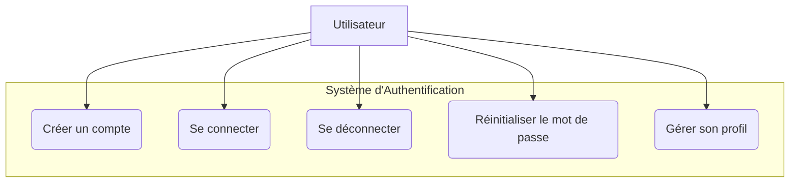

#### Diagrammes de Séquence - Sprint 1

**1. Cas d'utilisation : Créer un compte**

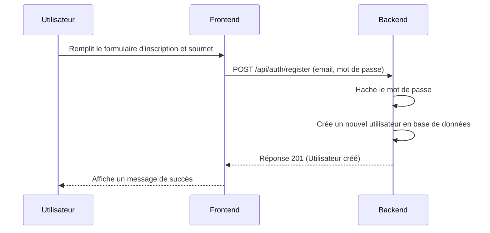

**2. Cas d'utilisation : Se connecter**

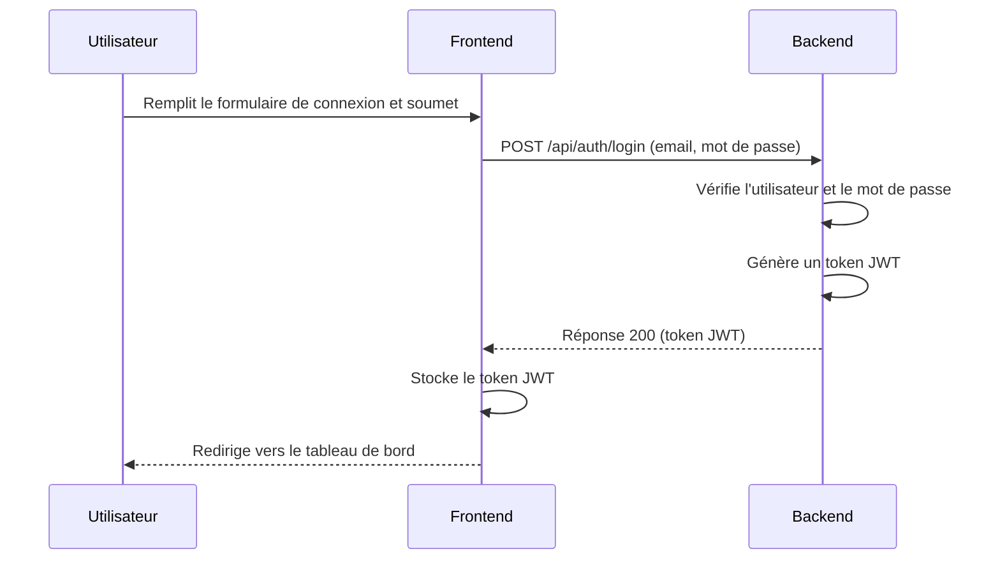

**3. Cas d'utilisation : Se déconnecter**

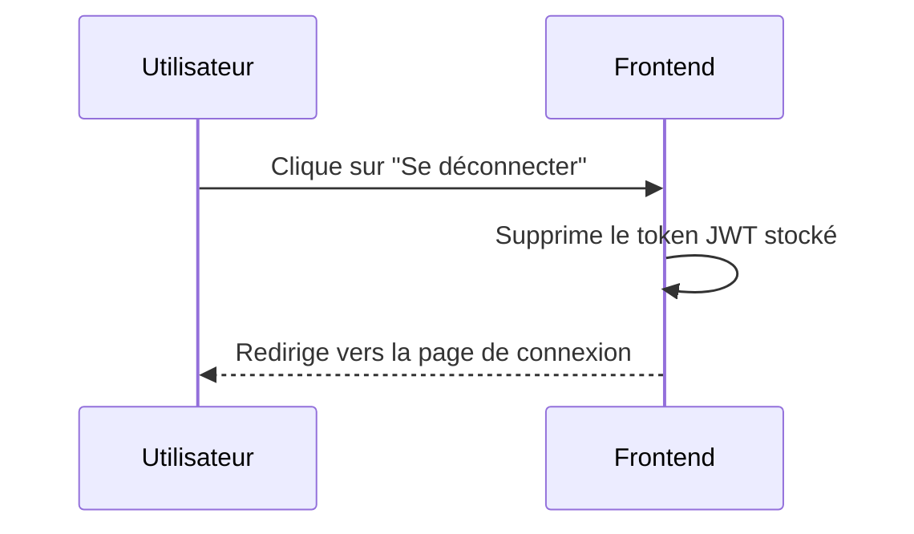

**4. Cas d'utilisation : Réinitialiser le mot de passe**

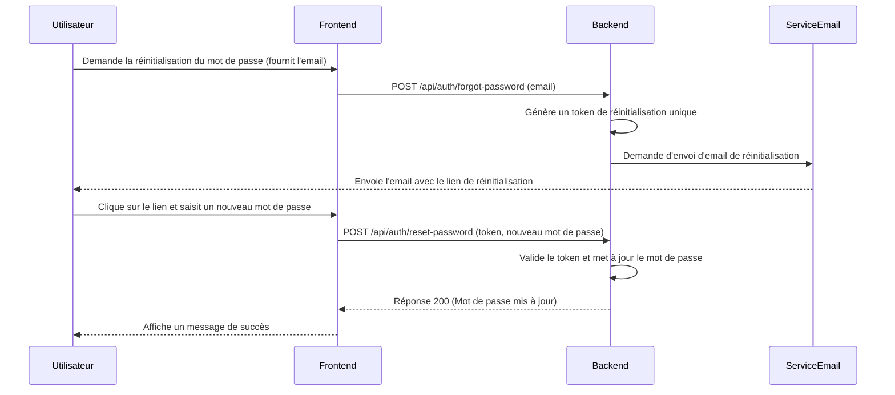

**5. Cas d'utilisation : Gérer son profil**

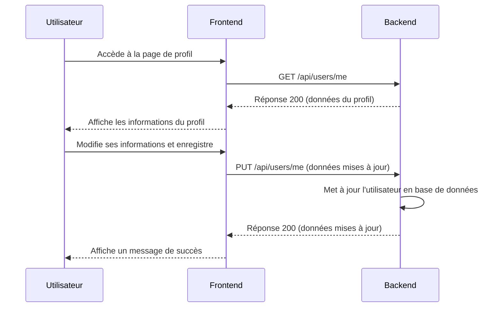

---

### Sprint 2 : Gestion des Publications

- **Objectif :** Permettre aux utilisateurs de gérer des publications.

#### Diagramme de Cas d'Utilisation (Use Case) - Sprint 2

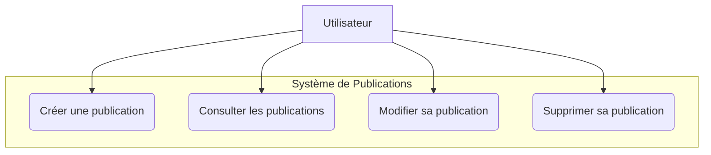

#### Diagrammes de Séquence - Sprint 2

**1. Cas d'utilisation : Créer une publication**

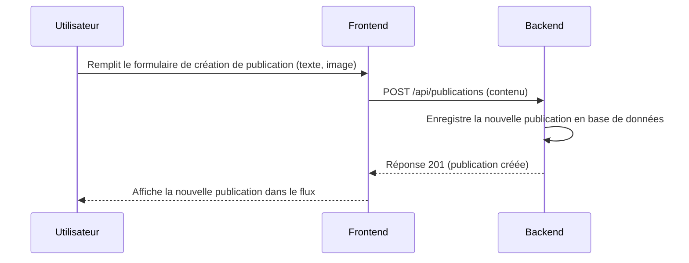

**2. Cas d'utilisation : Consulter les publications**

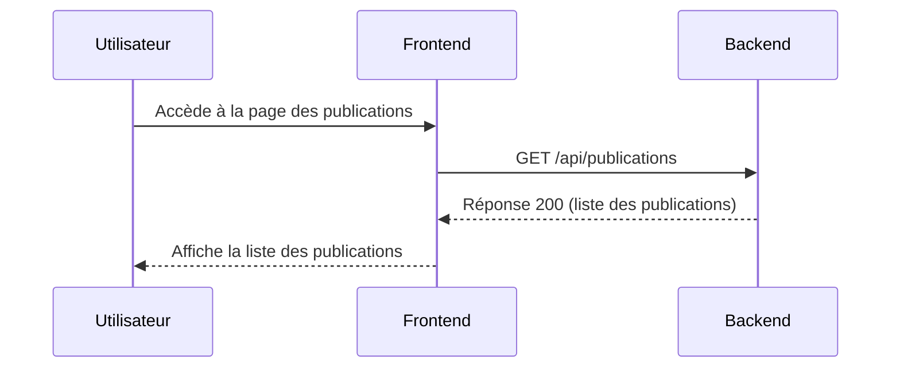

**3. Cas d'utilisation : Modifier sa publication**

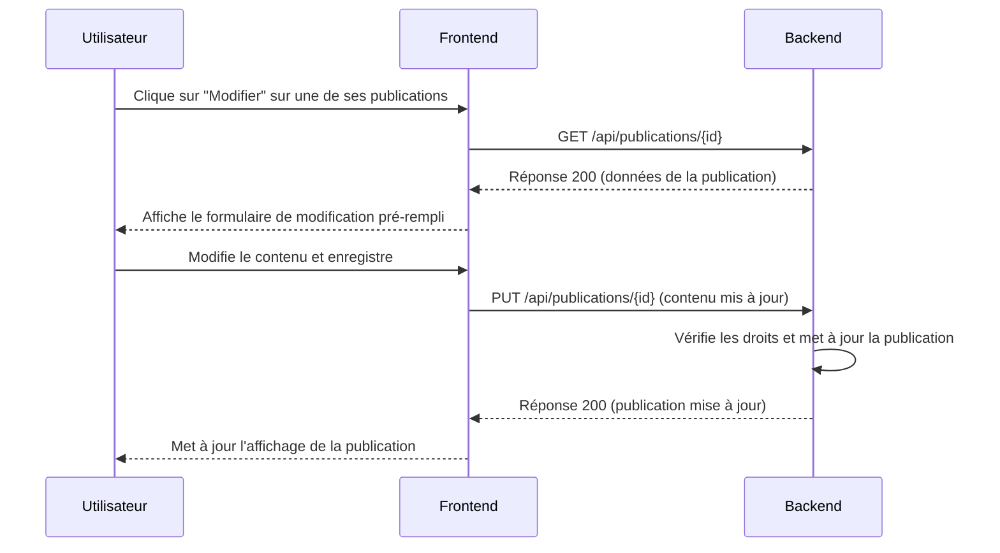

**4. Cas d'utilisation : Supprimer sa publication**

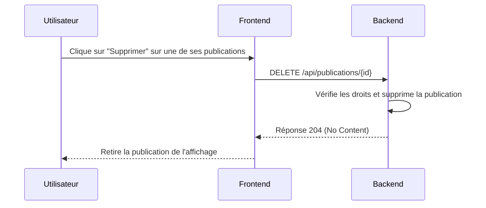

---

### Sprint 3 : Interactions Sociales et Notifications

- **Objectif :** Enrichir l'expérience avec des interactions et des notifications.

#### Diagramme de Cas d'Utilisation (Use Case) - Sprint 3

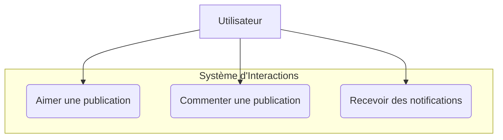

#### Diagrammes de Séquence - Sprint 3

**1. Cas d'utilisation : Aimer une publication**

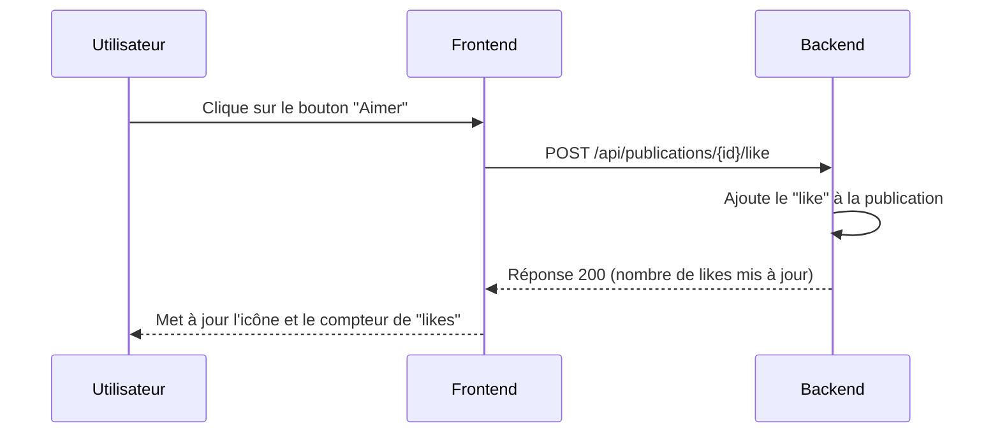

**2. Cas d'utilisation : Commenter une publication**

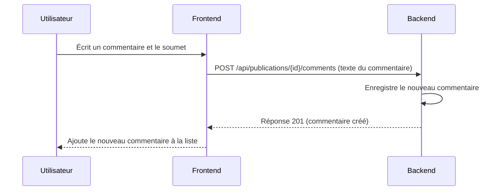

**3. Cas d'utilisation : Recevoir des notifications**

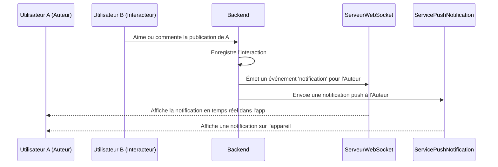

---

### Sprint 4 : Intégration du Chatbot

- **Objectif :** Fournir une assistance automatisée.

#### Diagramme de Cas d'Utilisation (Use Case) - Sprint 4

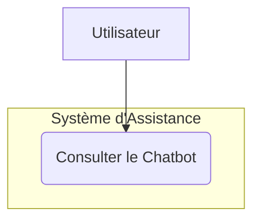

#### Diagramme de Séquence - Sprint 4

**1. Cas d'utilisation : Consulter le Chatbot**

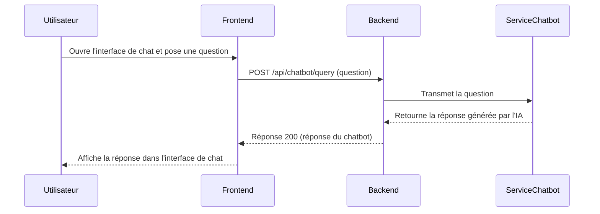

---

### Sprint 5 : Administration et Modération

- **Objectif :** Donner aux administrateurs les outils pour gérer la plateforme.

#### Diagramme de Cas d'Utilisation (Use Case) - Sprint 5

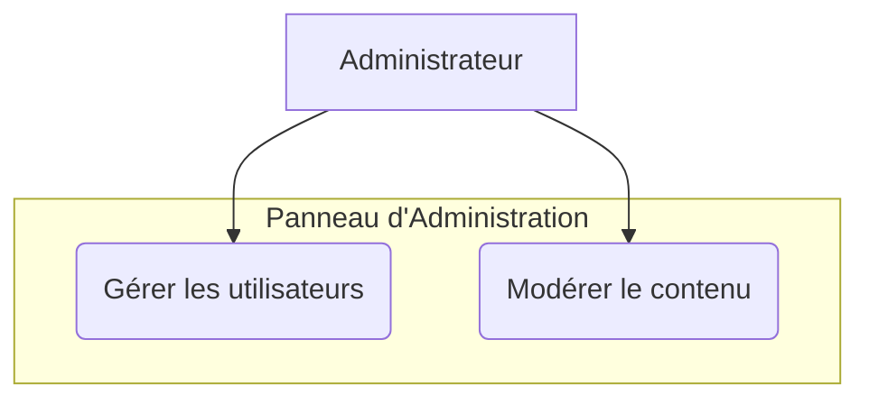

#### Diagrammes de Séquence - Sprint 5

**1. Cas d'utilisation : Gérer les utilisateurs**

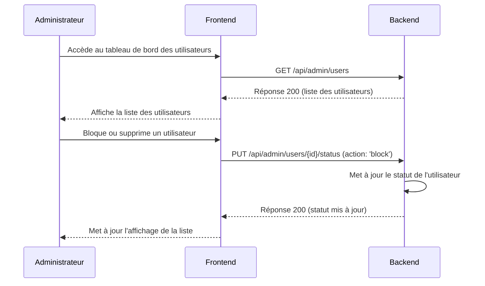

**2. Cas d'utilisation : Modérer le contenu**

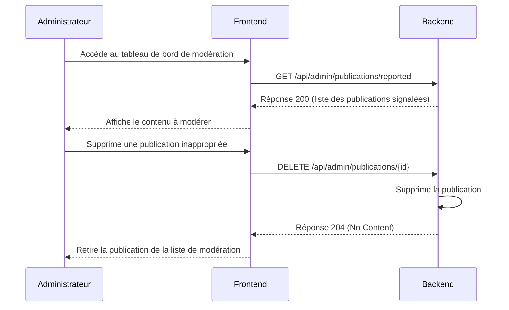
