# 📊 Diagramme de Cas d'Utilisation - Travelo

Ce document présente le diagramme de cas d'utilisation de l'application **Travelo**, une plateforme de voyage connectant les touristes et les organisateurs.

---

## 🎯 Objectif

Le diagramme illustre l'ensemble des interactions possibles entre les différents acteurs (Touriste, Organisateur) et le système Travelo.

---

## 👥 Acteurs

| Acteur           | Description                                                                  |
| ---------------- | ---------------------------------------------------------------------------- |
| **Touriste**     | Utilisateur recherchant des destinations et des expériences de voyage        |
| **Organisateur** | Utilisateur proposant des services touristiques et organisateur d'événements |
| **Système**      | Gestion automatique des processus (notifications, tokens, statuts)           |

---

## 📐 Diagramme PlantUML

### Code Source

```plantuml
@startuml "Diagramme de Cas d'Utilisation - Plateforme Travelo"

'═══════════════════════════════════════════════════════════
' CONFIGURATION VISUELLE
'═══════════════════════════════════════════════════════════
!theme plain
skinparam backgroundColor #F8F9FA
skinparam actorStyle awesome
skinparam packageStyle rectangle
skinparam roundcorner 10
skinparam shadowing false
skinparam linetype ortho

' Styles des cas d'utilisation
skinparam usecase {
    BackgroundColor #FFFFFF
    BorderColor #2196F3
    BorderThickness 2
    FontSize 11
    FontStyle bold
}

' Styles des acteurs avec stéréotypes
skinparam actor {
    BackgroundColor<<User>> #FFE0B2
    BorderColor<<User>> #FF6F00
    FontColor<<User>> #E65100
    BackgroundColor<<Touriste>> #A5D6A7
    BorderColor<<Touriste>> #388E3C
    FontColor<<Touriste>> #1B5E20
    BackgroundColor<<Organisateur>> #90CAF9
    BorderColor<<Organisateur>> #1976D2
    FontColor<<Organisateur>> #0D47A1
    BackgroundColor<<Admin>> #F48FB1
    BorderColor<<Admin>> #C2185B
    FontColor<<Admin>> #880E4F
    BackgroundColor<<System>> #BDBDBD
    BorderColor<<System>> #424242
    FontColor<<System>> #212121
}

' Styles des packages
skinparam package {
    BorderThickness 2
    FontSize 12
    FontStyle bold
}

' Styles des flèches
skinparam arrow {
    Thickness 1.5
}

left to right direction

'═══════════════════════════════════════════════════════════
' ACTEURS DU SYSTÈME
'═══════════════════════════════════════════════════════════
rectangle "ACTEURS" #E3F2FD {
    actor "👤\nUtilisateur" as user <<User>>
    actor "🧳\nTouriste" as touriste <<Touriste>>
    actor "🎯\nOrganisateur" as organisateur <<Organisateur>>
    actor "⚙️\nAdministrateur" as admin <<Admin>>
    actor "🤖\nSystème" as systeme <<System>>

    ' Hiérarchie d'héritage
    user <|-- touriste
    user <|-- organisateur
    user <|-- admin
}

'═══════════════════════════════════════════════════════════
' SYSTÈME PRINCIPAL
'═══════════════════════════════════════════════════════════
package "🌐 PLATEFORME TOURISTIQUE TRAVELO" #FFFFFF {

    '┌─────────────────────────────────────────────────────┐
    '│ MODULE 1 : AUTHENTIFICATION & PROFIL               │
    '└─────────────────────────────────────────────────────┘
    package "🔐 Authentification & Profil" #FFF3E0 {

        rectangle "Authentification" #FFECB3 {
            usecase (S'inscrire) as UC40 #FFE082
            usecase (  ↳ Valider email) as UC40a
            usecase (  ↳ Choisir type compte) as UC40b
            usecase (Se connecter) as UC41 #FFE082
            usecase (Se déconnecter) as UC42 #FFE082
        }

        rectangle "Gestion Profil" #FFECB3 {
            usecase (Gérer profil) as UC43 #FFE082
            usecase (  ↳ Modifier informations) as UC43a
            usecase (  ↳ Uploader photo) as UC43b
        }
    }

    '┌─────────────────────────────────────────────────────┐
    '│ MODULE 2 : ACTIVITÉS & ÉVÉNEMENTS                  │
    '└─────────────────────────────────────────────────────┘
    package "🎯 Activités & Événements" #E8F5E9 {

        rectangle "Gestion Organisateur" #C8E6C9 {
            usecase (Gérer mes activités) as UC1 #A5D6A7
            usecase (  ↳ Créer activité) as UC1a
            usecase (  ↳ Modifier activité) as UC1b
            usecase (  ↳ Supprimer activité) as UC1c
            usecase (Consulter participants) as UC5 #A5D6A7
        }

        rectangle "Gestion Admin" #C8E6C9 {
            usecase (Gérer toutes\nles activités) as UC6 #A5D6A7
        }

        rectangle "Gestion Touriste" #C8E6C9 {
            usecase (S'inscrire\nà une activité) as UC7 #A5D6A7
        }
    }

    '┌─────────────────────────────────────────────────────┐
    '│ MODULE 3 : AVIS & ÉVALUATIONS                      │
    '└─────────────────────────────────────────────────────┘
    package "⭐ Avis & Évaluations" #FFFDE7 {
        usecase (Gérer mes avis) as UC8 #FFF59D
        usecase (  ↳ Créer avis) as UC8a
        usecase (  ↳ Modifier avis) as UC8b
        usecase (  ↳ Supprimer avis) as UC8c
    }

    '┌─────────────────────────────────────────────────────┐
    '│ MODULE 4 : PARCOURS & LIEUX                        │
    '└─────────────────────────────────────────────────────┘
    package "🗺️ Parcours & Lieux" #E1F5FE {

        rectangle "Parcours Touristiques" #B3E5FC {
            usecase (Gérer parcours) as UC10 #81D4FA
            usecase (  ↳ Créer parcours) as UC10a
            usecase (  ↳ Modifier parcours) as UC10b
            usecase (  ↳ Supprimer parcours) as UC10c
            usecase (  ↳ Ajouter lieu) as UC10d
        }

        rectangle "Gestion Lieux (Admin)" #B3E5FC {
            usecase (Gérer lieux) as UC14 #81D4FA
            usecase (  ↳ Créer lieu) as UC14a
            usecase (  ↳ Modifier lieu) as UC14b
            usecase (  ↳ Supprimer lieu) as UC14c
        }
    }

    '┌─────────────────────────────────────────────────────┐
    '│ MODULE 5 : RÉSEAU SOCIAL                           │
    '└─────────────────────────────────────────────────────┘
    package "💬 Réseau Social" #F3E5F5 {

        rectangle "Publications" #E1BEE7 {
            usecase (Gérer mes\npublications) as UC23 #CE93D8
            usecase (  ↳ Publier) as UC24
            usecase (  ↳ Modifier) as UC23a
            usecase (  ↳ Supprimer) as UC23b
        }

        rectangle "Interactions" #E1BEE7 {
            usecase (Ajouter\ncommentaire) as UC20 #CE93D8
            usecase (Ajouter\nréaction) as UC21 #CE93D8
            usecase (Envoyer\nmessage) as UC22 #CE93D8
            usecase (Suivre\nutilisateur) as UC26 #CE93D8
        }

        rectangle "Modération (Admin)" #E1BEE7 {
            usecase (Modérer\npublications) as UC25 #CE93D8
        }
    }

    '┌─────────────────────────────────────────────────────┐
    '│ MODULE 6 : ADMINISTRATION                          │
    '└─────────────────────────────────────────────────────┘
    package "⚙️ Administration" #FFEBEE {

        rectangle "Gestion Utilisateurs" #FFCDD2 {
            usecase (Gérer\nutilisateurs) as UC30 #EF9A9A
            usecase (  ↳ Suspendre) as UC30a
            usecase (  ↳ Supprimer) as UC30b
            usecase (  ↳ Réactiver) as UC30c
        }

        rectangle "Analytics" #FFCDD2 {
            usecase (Consulter\nstatistiques) as UC33 #EF9A9A
        }
    }

    '┌─────────────────────────────────────────────────────┐
    '│ MODULE 7 : SYSTÈME AUTOMATIQUE                     │
    '└─────────────────────────────────────────────────────┘
    package "🔧 Services Système" #ECEFF1 {
        usecase (Générer\ntoken JWT) as UC50 #B0BEC5
        usecase (Valider\nauthentification) as UC51 #B0BEC5
        usecase (Envoyer\nnotification) as UC52 #B0BEC5
        usecase (Enregistrer\nlogs) as UC53 #B0BEC5
        usecase (Mettre à jour\nstatut) as UC54 #B0BEC5
    }
}

'═══════════════════════════════════════════════════════════
' RELATIONS : ACTEURS → CAS D'UTILISATION
'═══════════════════════════════════════════════════════════

'─── Utilisateur (Cas d'usage communs) ───
user -right-> UC40 : <color:#FF6F00>inscription</color>
user -right-> UC41 : <color:#FF6F00>connexion</color>
user -right-> UC42 : <color:#FF6F00>déconnexion</color>
user -right-> UC43 : <color:#FF6F00>profil</color>
user -right-> UC20 : <color:#FF6F00>commente</color>
user -right-> UC21 : <color:#FF6F00>réagit</color>
user -right-> UC22 : <color:#FF6F00>message</color>
user -right-> UC23 : <color:#FF6F00>publie</color>
user -right-> UC26 : <color:#FF6F00>suit</color>

'─── Touriste (Cas d'usage spécifiques) ───
touriste -right-> UC7 : <color:#388E3C>s'inscrit</color>
touriste -right-> UC8 : <color:#388E3C>évalue</color>
touriste -right-> UC10 : <color:#388E3C>planifie</color>

'─── Organisateur (Cas d'usage spécifiques) ───
organisateur -right-> UC1 : <color:#1976D2>organise</color>
organisateur -right-> UC5 : <color:#1976D2>supervise</color>

'─── Administrateur (Cas d'usage spécifiques) ───
admin -right-> UC6 : <color:#C2185B>modère</color>
admin -right-> UC14 : <color:#C2185B>gère lieux</color>
admin -right-> UC25 : <color:#C2185B>modère contenu</color>
admin -right-> UC30 : <color:#C2185B>administre</color>
admin -right-> UC33 : <color:#C2185B>analyse</color>

'─── Système (Actions automatiques) ───
systeme -right-> UC50 : <color:#424242>auto</color>
systeme -right-> UC51 : <color:#424242>auto</color>
systeme -right-> UC52 : <color:#424242>auto</color>
systeme -right-> UC53 : <color:#424242>auto</color>
systeme -right-> UC54 : <color:#424242>auto</color>

'═══════════════════════════════════════════════════════════
' RELATIONS : <<INCLUDE>> (Dépendances Obligatoires)
'═══════════════════════════════════════════════════════════

'─── MODULE AUTHENTIFICATION ───
UC40 .down.> UC40a : <<include>>
UC40 .down.> UC40b : <<include>>
UC40 .down.> UC50 : <<include>>
UC41 .down.> UC50 : <<include>>
UC41 .down.> UC51 : <<include>>
UC42 .down.> UC54 : <<include>>
UC43 .down.> UC43a : <<include>>

'─── MODULE ACTIVITÉS ───
UC1 .down.> UC1a : <<include>>

'─── MODULE AVIS ───
UC8 .down.> UC8a : <<include>>

'─── MODULE PARCOURS ───
UC10 .down.> UC10a : <<include>>

'─── MODULE LIEUX ───
UC14 .down.> UC14a : <<include>>

'─── MODULE SOCIAL ───
UC23 .down.> UC24 : <<include>>

'─── MODULE ADMINISTRATION ───
UC30 .down.> UC30a : <<include>>
UC30 .down.> UC30b : <<include>>

'═══════════════════════════════════════════════════════════
' RELATIONS : <<EXTEND>> (Extensions Optionnelles)
'═══════════════════════════════════════════════════════════

'─── MODULE AUTHENTIFICATION ───
UC43b .up.> UC43 : <<extend>>

'─── MODULE ACTIVITÉS ───
UC1b .up.> UC1 : <<extend>>
UC1c .up.> UC1 : <<extend>>
UC5 .left.> UC1 : <<extend>>

'─── MODULE AVIS ───
UC8b .up.> UC8 : <<extend>>
UC8c .up.> UC8 : <<extend>>

'─── MODULE PARCOURS ───
UC10b .up.> UC10 : <<extend>>
UC10c .up.> UC10 : <<extend>>
UC10d .up.> UC10 : <<extend>>

'─── MODULE LIEUX ───
UC14b .up.> UC14 : <<extend>>
UC14c .up.> UC14 : <<extend>>

'─── MODULE SOCIAL ───
UC23a .up.> UC23 : <<extend>>
UC23b .up.> UC23 : <<extend>>
UC26 .left.> UC22 : <<extend>>

'─── MODULE ADMINISTRATION ───
UC30c .up.> UC30 : <<extend>>

'─── INTERACTIONS SYSTÈME ───
UC52 ..> UC7 : <<extend>>
UC52 ..> UC1a : <<extend>>
UC52 ..> UC22 : <<extend>>
UC53 ..> UC40 : <<extend>>
UC53 ..> UC41 : <<extend>>
UC53 ..> UC30 : <<extend>>

'═══════════════════════════════════════════════════════════
' ANNOTATIONS & DOCUMENTATION
'═══════════════════════════════════════════════════════════

note top of user #FFE0B2
    <b><size:13>👤 UTILISATEUR BASE</size></b>
    ━━━━━━━━━━━━━━━━━━━━━━━━
    Tous les utilisateurs peuvent :
    • Se créer un compte
    • Se connecter/déconnecter
    • Gérer leur profil
    • Interagir socialement
end note

note right of touriste #A5D6A7
    <b><size:13>🧳 TOURISTE</size></b>
    ━━━━━━━━━━━━━━━━━━━━━━━━
    <b>Hérite de :</b> Utilisateur

    <b>Spécialisation :</b>
    • S'inscrit aux activités
    • Crée des parcours
    • Poste des avis
    • Partage expériences

    <b>Objectif :</b>
    Découvrir et vivre
    des expériences
end note

note left of organisateur #90CAF9
    <b><size:13>🎯 ORGANISATEUR</size></b>
    ━━━━━━━━━━━━━━━━━━━━━━━━
    <b>Hérite de :</b> Utilisateur

    <b>Spécialisation :</b>
    • Crée des activités
    • Gère participants
    • Propose expériences

    <b>Objectif :</b>
    Organiser et gérer
    des événements
end note

note bottom of admin #F48FB1
    <b><size:13>⚙️ ADMINISTRATEUR</size></b>
    ━━━━━━━━━━━━━━━━━━━━━━━━
    <b>Hérite de :</b> Utilisateur

    <b>Responsabilités :</b>
    • Supervise plateforme
    • Modère contenus
    • Gère utilisateurs
    • Analyse statistiques
    • Gère infrastructure

    <b>Pouvoir :</b> Contrôle total
end note

note top of systeme #BDBDBD
    <b><size:13>🤖 SYSTÈME</size></b>
    ━━━━━━━━━━━━━━━━━━━━━━━━
    <b>Services automatiques :</b>
    • Authentification JWT
    • Notifications push/email
    • Journalisation (logs)
    • Mise à jour statuts
    • Sécurité & validation

    <b>Type :</b> Acteur technique
end note

legend bottom left
    <b><size:14>📖 LÉGENDE DU DIAGRAMME</size></b>
    ━━━━━━━━━━━━━━━━━━━━━━━━━━━━━━━━━━━━━━

    <b>Relations entre cas d'utilisation :</b>
    • <<include>> = <color:#0000FF><b>Obligatoire</b></color> (toujours exécuté)
    • <<extend>> = <color:#FF6600><b>Optionnel</b></color> (conditionnel)
    • <b>──></b> = Association acteur → cas d'usage
    • <b><|--</b> = Héritage (généralisation)

    <b>Couleurs des modules :</b>
    • <color:#FF9800>🔐 Orange</color> = Authentification
    • <color:#4CAF50>🎯 Vert</color> = Activités
    • <color:#FDD835>⭐ Jaune</color> = Avis
    • <color:#03A9F4>🗺️ Bleu</color> = Parcours & Lieux
    • <color:#9C27B0>💬 Violet</color> = Social
    • <color:#E91E63>⚙️ Rose</color> = Administration
    • <color:#616161>🔧 Gris</color> = Système

    <b>Symboles dans cas d'usage :</b>
    • <b>↳</b> = Sous-action / cas inclus
end legend

footer
    <b>Plateforme Travelo</b> | Diagramme de Cas d'Utilisation
    Version 2.0 | Mars 2026
    Modélisation UML - PlantUML
endfooter

@enduml
```



---

## 📝 Description des Cas d'Utilisation

### 🔐 Authentification

| ID  | Cas d'Utilisation      | Description                                                                     | Acteur(s)              |
| --- | ---------------------- | ------------------------------------------------------------------------------- | ---------------------- |
| UC1 | S'inscrire             | Créer un nouveau compte avec email, mot de passe, nom complet et type de compte | Touriste, Organisateur |
| UC2 | Se connecter           | Connexion avec email et mot de passe, génération de tokens JWT                  | Touriste, Organisateur |
| UC3 | Se déconnecter         | Déconnexion avec mise à jour du statut et nettoyage des tokens                  | Touriste, Organisateur |
| UC4 | Choisir type de compte | Sélection entre Touriste ou Organisateur lors de l'inscription                  | Système                |
| UC5 | Valider email          | Validation du format de l'adresse email                                         | Système                |
| UC6 | Générer token JWT      | Création d'access token (15min) et refresh token (7 jours)                      | Système                |
| UC7 | Social Login           | Connexion via Google ou Facebook (UI uniquement)                                | Touriste, Organisateur |

### 👤 Gestion du Profil

| ID   | Cas d'Utilisation                  | Description                                              | Acteur(s)              |
| ---- | ---------------------------------- | -------------------------------------------------------- | ---------------------- |
| UC10 | Consulter profil                   | Afficher toutes les informations du profil utilisateur   | Touriste, Organisateur |
| UC11 | Modifier profil                    | Éditer les informations personnelles du profil           | Touriste, Organisateur |
| UC12 | Uploader photo                     | Télécharger une photo de profil depuis caméra ou galerie | Touriste, Organisateur |
| UC13 | Modifier informations personnelles | Changer nom, âge, téléphone, etc.                        | Touriste, Organisateur |
| UC14 | Sélectionner pays                  | Choisir parmi 195 pays avec drapeaux                     | Touriste, Organisateur |
| UC15 | Sélectionner langue                | Choisir parmi 49 langues (Touriste uniquement)           | Touriste               |
| UC16 | Modifier bio                       | Rédiger une biographie (500 caractères max)              | Touriste, Organisateur |
| UC17 | Partager profil                    | Copier les informations du profil dans le presse-papiers | Touriste, Organisateur |
| UC18 | Gérer confidentialité              | Gérer les paramètres de confidentialité des données      | Touriste, Organisateur |

### 🎨 Onboarding

| ID   | Cas d'Utilisation    | Description                                                    | Acteur(s)              |
| ---- | -------------------- | -------------------------------------------------------------- | ---------------------- |
| UC20 | Compléter onboarding | Processus d'intégration en 3 étapes pour nouveaux utilisateurs | Touriste, Organisateur |
| UC21 | Renseigner âge       | Saisir l'âge (validation 13-120 ans)                           | Touriste, Organisateur |
| UC22 | Renseigner téléphone | Saisir le numéro de téléphone                                  | Touriste, Organisateur |
| UC23 | Rédiger bio          | Écrire une biographie avec compteur de caractères              | Touriste, Organisateur |
| UC24 | Passer l'étape       | Sauter une étape optionnelle de l'onboarding                   | Touriste, Organisateur |

### 💖 Centres d'Intérêt

| ID   | Cas d'Utilisation       | Description                                                    | Acteur(s)              |
| ---- | ----------------------- | -------------------------------------------------------------- | ---------------------- |
| UC30 | Gérer préférences       | Gérer ses centres d'intérêt de voyage                          | Touriste, Organisateur |
| UC31 | Sélectionner catégories | Choisir parmi 20 catégories (Plages, Montagnes, Culture, etc.) | Touriste, Organisateur |
| UC32 | Supprimer préférences   | Retirer des catégories sélectionnées                           | Touriste, Organisateur |
| UC33 | Enregistrer préférences | Sauvegarder les préférences via API                            | Système                |

### 🔔 Notifications

| ID   | Cas d'Utilisation                      | Description                                                   | Acteur(s)              |
| ---- | -------------------------------------- | ------------------------------------------------------------- | ---------------------- |
| UC40 | Activer/Désactiver notifications email | Toggle pour les notifications par email                       | Touriste, Organisateur |
| UC41 | Activer/Désactiver notifications SMS   | Toggle pour les notifications par SMS                         | Touriste, Organisateur |
| UC42 | Accepter consentement données          | Accepter le traitement des données personnelles (obligatoire) | Touriste, Organisateur |

### ☁️ Cloudinary

| ID   | Cas d'Utilisation    | Description                                     | Acteur(s) |
| ---- | -------------------- | ----------------------------------------------- | --------- |
| UC60 | Uploader vers Cloud  | Envoyer l'image vers le service Cloudinary      | Système   |
| UC61 | Redimensionner image | Redimensionner automatiquement l'image uploadée | Système   |

---

## 🔗 Relations entre Cas d'Utilisation

### Relations `<<include>>` (Obligatoires)

- **S'inscrire** inclut :
  - Choisir type de compte
  - Valider email
  - Générer token JWT

- **Se connecter** inclut :
  - Générer token JWT

- **Modifier profil** inclut :
  - Modifier informations personnelles

- **Uploader photo** inclut :
  - Uploader vers Cloud
  - Redimensionner image

- **Compléter onboarding** inclut :
  - Renseigner âge
  - Renseigner téléphone
  - Rédiger bio

- **Gérer préférences** inclut :
  - Sélectionner catégories
  - Enregistrer préférences

### Relations `<<extend>>` (Optionnelles)

- **S'inscrire** peut être étendu par :
  - Social Login (Google/Facebook)

- **Modifier profil** peut être étendu par :
  - Uploader photo
  - Sélectionner pays
  - Modifier bio
  - Sélectionner langue (Touriste uniquement)

- **Consulter profil** peut être étendu par :
  - Partager profil
  - Gérer confidentialité

- **Compléter onboarding** peut être étendu par :
  - Passer l'étape

- **Gérer préférences** peut être étendu par :
  - Supprimer préférences

---

## 🎨 Visualisation du Diagramme

### Option 1 : PlantUML en ligne

1. Copier le code PlantUML ci-dessus
2. Se rendre sur [PlantUML Web Server](http://www.plantuml.com/plantuml/uml/)
3. Coller le code dans l'éditeur
4. Le diagramme s'affiche automatiquement

### Option 2 : VS Code

1. Installer l'extension **PlantUML** dans VS Code
2. Ouvrir ce fichier
3. Utiliser `Alt+D` pour prévisualiser le diagramme

### Option 3 : Export PNG/SVG

```bash
# Installation de PlantUML (nécessite Java)
java -jar plantuml.jar USE_CASE_DIAGRAM.md
```

---

## 📊 Statistiques du Projet

- **3** Acteurs (Touriste, Organisateur, Système)
- **30** Cas d'utilisation
- **5** Packages fonctionnels
- **195** Pays disponibles
- **49** Langues disponibles
- **20** Catégories de centres d'intérêt

---

## 🔄 Légende

| Symbole       | Signification                                                                          |
| ------------- | -------------------------------------------------------------------------------------- |
| `<<include>>` | Relation obligatoire - Le cas d'utilisation source inclut toujours le cas cible        |
| `<<extend>>`  | Relation optionnelle - Le cas d'utilisation peut être étendu dans certaines conditions |
| `-->`         | Association - L'acteur peut exécuter le cas d'utilisation                              |

---

## 📌 Notes Importantes

### Différences Touriste vs Organisateur

| Fonctionnalité      | Touriste | Organisateur |
| ------------------- | -------- | ------------ |
| Sélection de langue | ✅ Oui   | ❌ Non       |

| Gestion profil | ✅ Oui | ✅ Oui |
| Centres d'intérêt | ✅ Oui | ✅ Oui |
| Notifications | ✅ Oui | ✅ Oui |

### Validations Système

- **Âge** : Entre 13 et 120 ans
- **Bio** : Maximum 500 caractères
- **Mot de passe** : Doit être sécurisé
- **Email** : Format valide requis
- **Token JWT** : Access token expire après 15 minutes
- **Refresh Token** : Expire après 7 jours

---

## 🛠️ Technologies Utilisées

- **Backend** : Node.js, Express, MongoDB
- **Frontend** : Flutter
- **Authentification** : JWT (JSON Web Tokens)
- **Stockage Images** : Cloudinary
- **Modélisation** : PlantUML

---

## 📖 Documentation Complémentaire

- [FEATURES.md](FEATURES.md) - Liste détaillée des fonctionnalités
- [API_REFERENCE.md](API_REFERENCE.md) - Documentation de l'API REST
- [ARCHITECTURE.md](ARCHITECTURE.md) - Architecture du projet
- [SETUP.md](SETUP.md) - Guide d'installation

---

## 📅 Dernière Mise à Jour

**Date** : 2 Mars 2026  
**Version** : 1.0.0  
**Auteur** : Équipe Travelo

---

## 📄 Licence

Ce document fait partie du projet Travelo et est destiné à un usage interne et éducatif.
