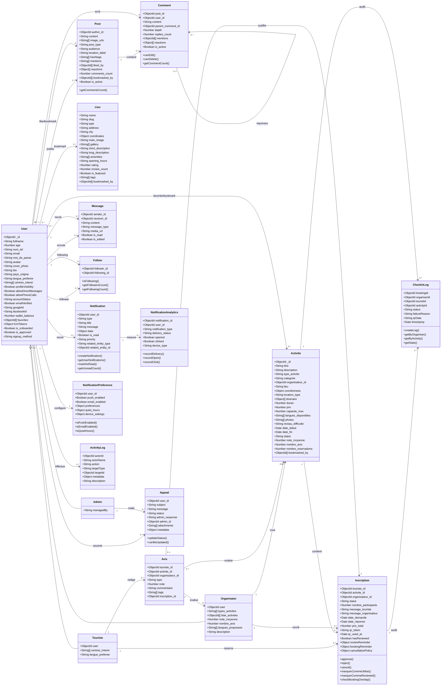

# Diagramme De Classes DJTrip Sans Paiement

Ce diagramme represente le modele metier principal du backend DJTrip.

Le systeme de paiement est volontairement exclu. Les classes `Payment` et `Invoice` ne sont pas representees.

