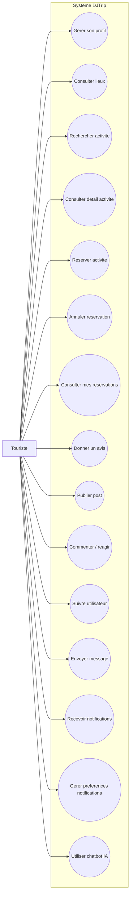
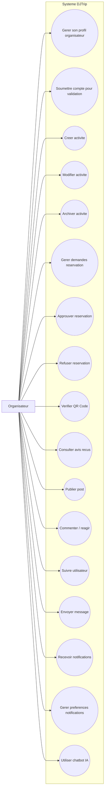
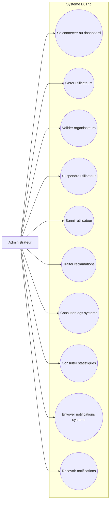

# Diagrammes De Cas D'utilisation DJTrip Sans Paiement

Ce document contient les diagrammes de cas d'utilisation corriges du projet DJTrip.

Le systeme de paiement est volontairement exclu. Les elements `Payment`, `Invoice`, facture, paiement Stripe et remboursement ne sont pas representes.

Le diagramme general utilise un acteur parent `Utilisateur` pour regrouper les cas communs aux trois acteurs. Les acteurs `Touriste`, `Organisateur` et `Administrateur` heritent de `Utilisateur` et sont relies seulement a leurs cas d'utilisation specifiques.

## Diagramme Global

```mermaid
flowchart LR
    Utilisateur["Acteur: Utilisateur"]
    Touriste["Acteur: Touriste"]
    Organisateur["Acteur: Organisateur"]
    Admin["Acteur: Administrateur"]

    subgraph DJTrip["Systeme DJTrip"]
        UC1(("Creer un compte"))
        UC2(("Se connecter"))
        UC3(("Gerer son profil"))
        UC4(("Recevoir notifications"))
        UC5(("Gerer preferences notifications"))

        UC6(("Consulter les lieux touristiques"))
        UC7(("Rechercher une activite"))
        UC8(("Consulter detail activite"))
        UC9(("Reserver une activite"))
        UC10(("Annuler une reservation"))
        UC11(("Consulter mes reservations"))
        UC12(("Donner un avis"))

        UC13(("Creer une activite"))
        UC14(("Modifier une activite"))
        UC15(("Supprimer / archiver une activite"))
        UC16(("Gerer les demandes de reservation"))
        UC17(("Approuver reservation"))
        UC18(("Refuser reservation"))
        UC19(("Scanner / verifier QR Code"))
        UC20(("Consulter avis recus"))

        UC21(("Publier un post"))
        UC22(("Commenter une publication"))
        UC23(("Reagir a une publication"))
        UC24(("Suivre un utilisateur"))
        UC25(("Envoyer un message"))
        UC26(("Utiliser chatbot IA"))

        UC27(("Se connecter au dashboard"))
        UC28(("Gerer utilisateurs"))
        UC29(("Valider organisateurs"))
        UC30(("Suspendre utilisateur"))
        UC31(("Bannir utilisateur"))
        UC32(("Traiter reclamations"))
        UC33(("Consulter logs systeme"))
        UC34(("Consulter statistiques"))
        UC35(("Envoyer notifications systeme"))
    end

    Touriste -.-> Utilisateur
    Organisateur -.-> Utilisateur
    Admin -.-> Utilisateur

    Utilisateur --> UC1
    Utilisateur --> UC2
    Utilisateur --> UC3
    Utilisateur --> UC4
    Utilisateur --> UC5

    Touriste --> UC6
    Touriste --> UC7
    Touriste --> UC8
    Touriste --> UC9
    Touriste --> UC10
    Touriste --> UC11
    Touriste --> UC12
    Touriste --> UC21
    Touriste --> UC22
    Touriste --> UC23
    Touriste --> UC24
    Touriste --> UC25
    Touriste --> UC26

    Organisateur --> UC13
    Organisateur --> UC14
    Organisateur --> UC15
    Organisateur --> UC16
    Organisateur --> UC17
    Organisateur --> UC18
    Organisateur --> UC19
    Organisateur --> UC20
    Organisateur --> UC21
    Organisateur --> UC22
    Organisateur --> UC23
    Organisateur --> UC24
    Organisateur --> UC25
    Organisateur --> UC26

    Admin --> UC27
    Admin --> UC28
    Admin --> UC29
    Admin --> UC30
    Admin --> UC31
    Admin --> UC32
    Admin --> UC33
    Admin --> UC34
    Admin --> UC35
```

## Touriste

## Organisateur

## Administrateur

