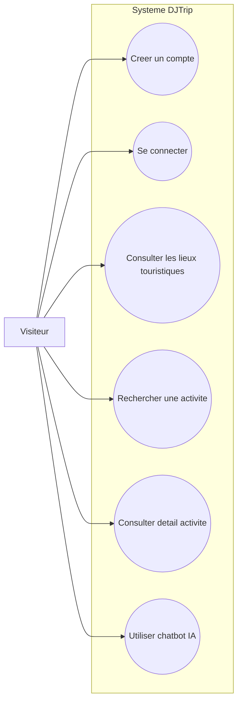
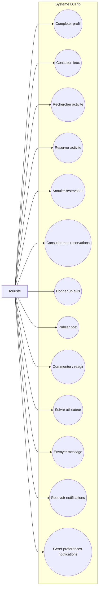
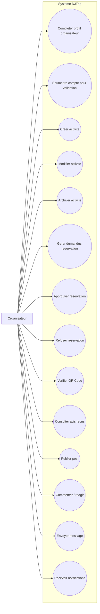
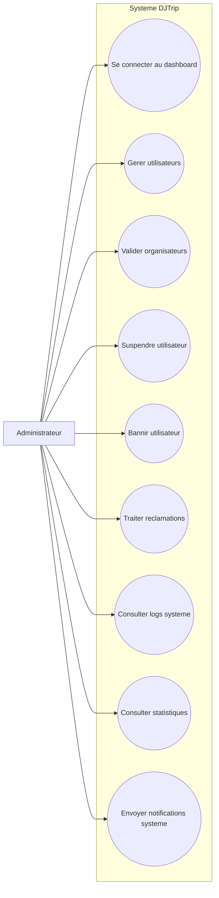

# Diagrammes De Cas D'utilisation DJTrip Sans Paiement

Ce document contient les diagrammes de cas d'utilisation corriges du projet DJTrip.

Le systeme de paiement est volontairement exclu. Les elements `Payment`, `Invoice`, facture, paiement Stripe et remboursement ne sont pas representes.

## Diagramme Global

```mermaid
flowchart LR
    Touriste["Acteur: Touriste"]
    Organisateur["Acteur: Organisateur"]
    Admin["Acteur: Administrateur"]

    subgraph DJTrip["Systeme DJTrip"]
        UC1(("Creer un compte"))
        UC2(("Se connecter"))
        UC3(("Completer le profil"))
        UC5(("Consulter les lieux touristiques"))
        UC6(("Rechercher une activite"))
        UC7(("Consulter detail activite"))
        UC8(("Reserver une activite"))
        UC9(("Annuler une reservation"))
        UC10(("Consulter mes reservations"))
        UC11(("Scanner / verifier QR Code"))
        UC12(("Donner un avis"))
        UC13(("Creer une activite"))
        UC14(("Modifier une activite"))
        UC15(("Supprimer / archiver une activite"))
        UC16(("Gerer les demandes de reservation"))
        UC17(("Publier un post"))
        UC18(("Commenter une publication"))
        UC19(("Reagir a une publication"))
        UC20(("Suivre un utilisateur"))
        UC21(("Envoyer un message"))
        UC22(("Recevoir notifications"))
        UC23(("Gerer preferences notifications"))
        UC24(("Gerer utilisateurs"))
        UC25(("Valider organisateurs"))
        UC26(("Suspendre / bannir utilisateur"))
        UC27(("Traiter reclamation"))
        UC28(("Consulter logs systeme"))
        UC29(("Utiliser chatbot IA"))
    end

    Touriste --> UC1
    Touriste --> UC2
    Touriste --> UC3
    Touriste --> UC5
    Touriste --> UC6
    Touriste --> UC7
    Touriste --> UC8
    Touriste --> UC9
    Touriste --> UC10
    Touriste --> UC12
    Touriste --> UC17
    Touriste --> UC18
    Touriste --> UC19
    Touriste --> UC20
    Touriste --> UC21
    Touriste --> UC22
    Touriste --> UC23
    Touriste --> UC29

    Organisateur --> UC1
    Organisateur --> UC2
    Organisateur --> UC3
    Organisateur --> UC13
    Organisateur --> UC14
    Organisateur --> UC15
    Organisateur --> UC16
    Organisateur --> UC11
    Organisateur --> UC17
    Organisateur --> UC18
    Organisateur --> UC19
    Organisateur --> UC20
    Organisateur --> UC21
    Organisateur --> UC22
    Organisateur --> UC23
    Organisateur --> UC29

    Admin --> UC2
    Admin --> UC24
    Admin --> UC25
    Admin --> UC26
    Admin --> UC27
    Admin --> UC28
    Admin --> UC22
```

## Visiteur

## Touriste

## Organisateur

## Administrateur

