# Sprint 4 - Communication et reseau social

## Diagramme de cas d'utilisation

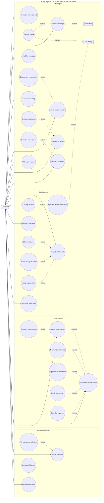

## Diagrammes de sequence

### M1 - Consulter conversations

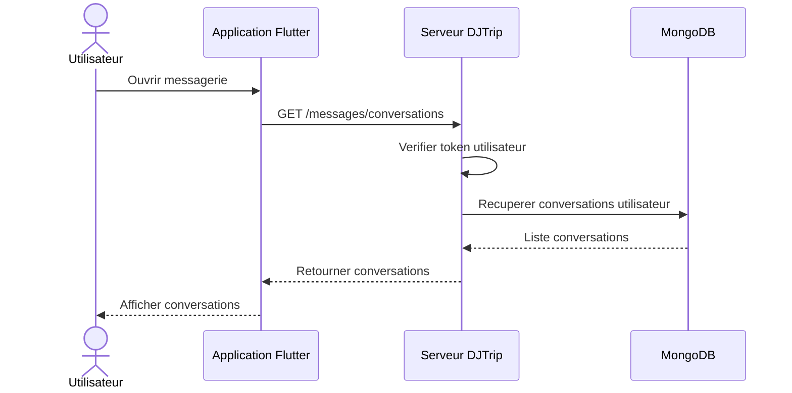

### M2 - Envoyer message

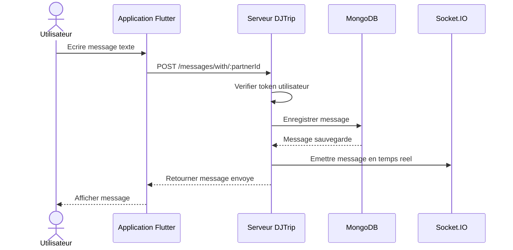

### M3 - Envoyer media

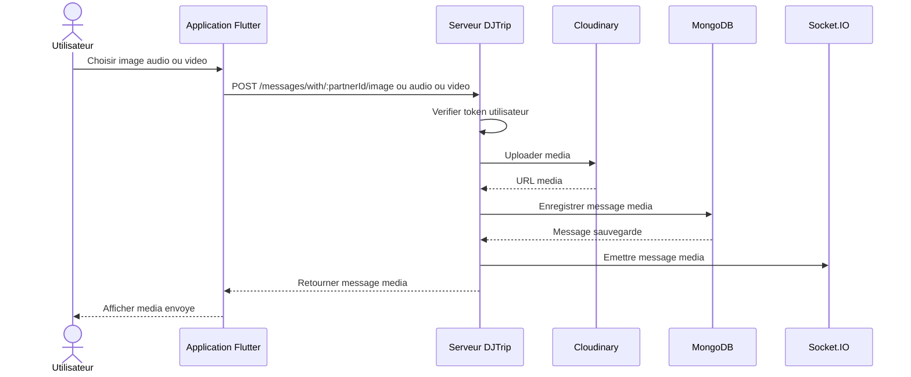

### M4 - Modifier message

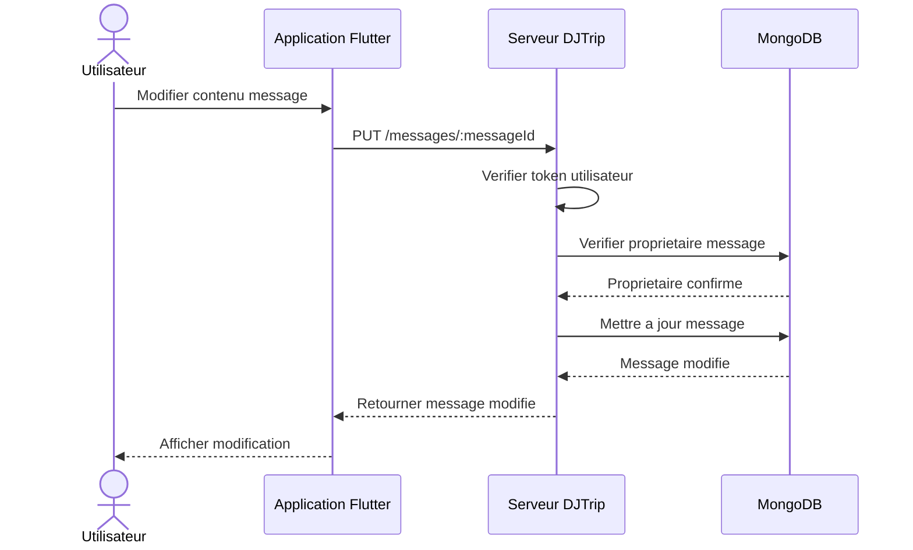

### M5 - Supprimer message

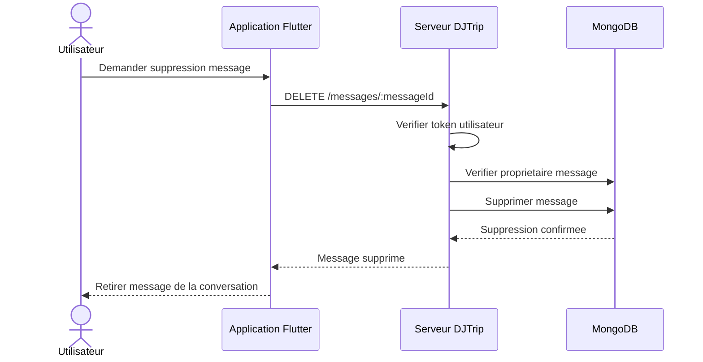

### M6 - Archiver conversation

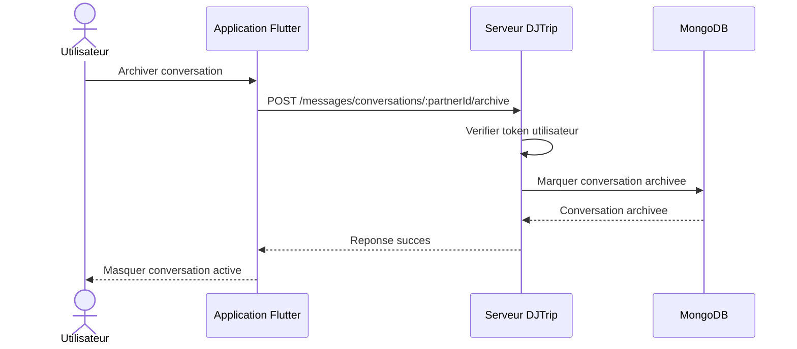

### M7 - Desarchiver conversation

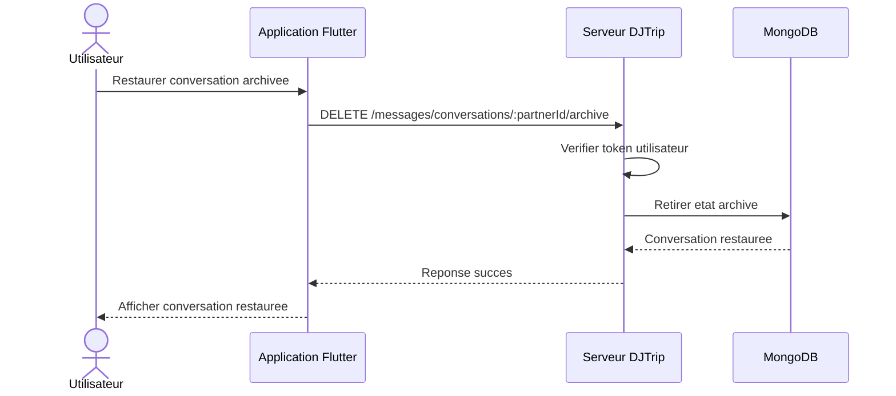

### M8 - Vider conversation

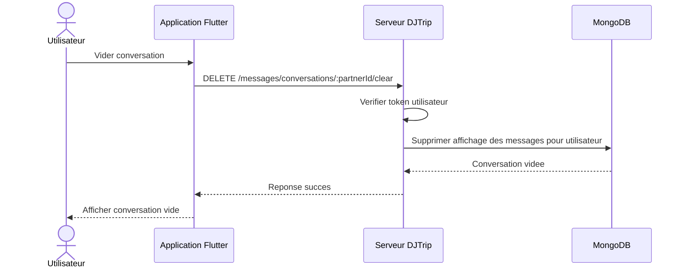

### M9 - Bloquer utilisateur

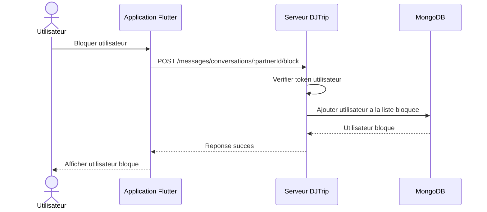

### M10 - Debloquer utilisateur

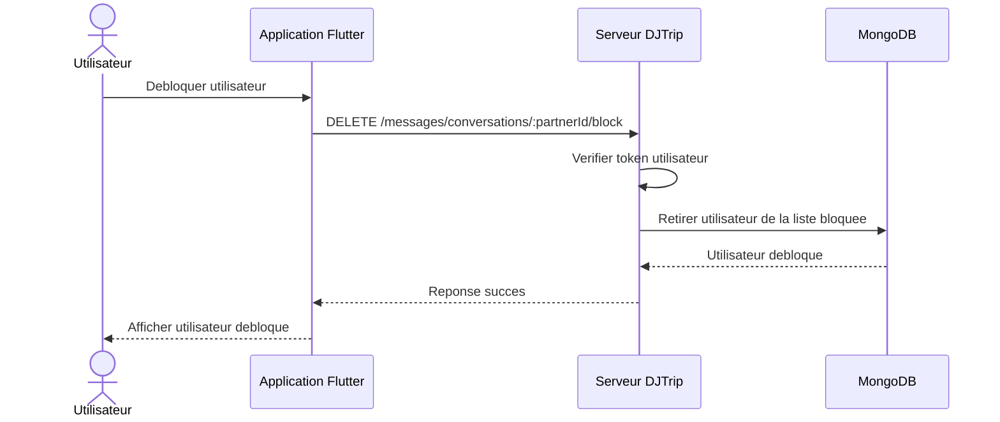

### M11 - Muter conversation

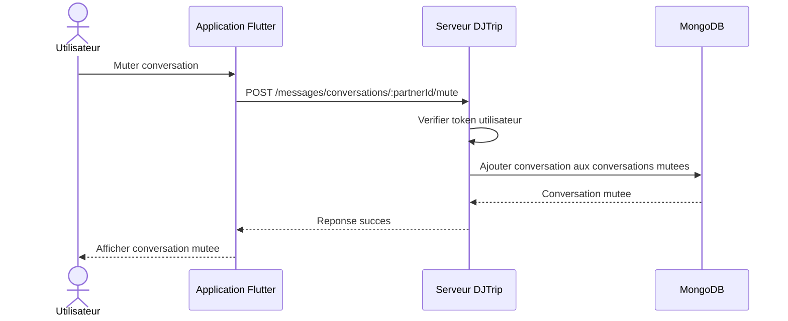

### M12 - Demuter conversation

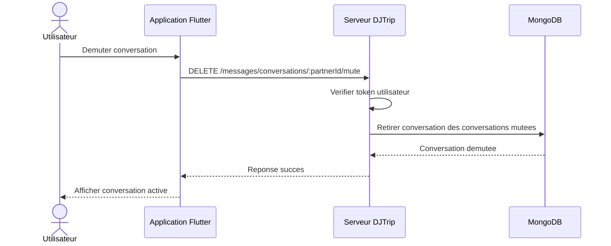

### P1 - Consulter fil actualite

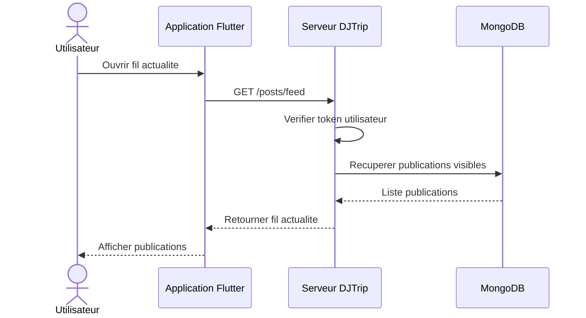

### P2 - Creer publication

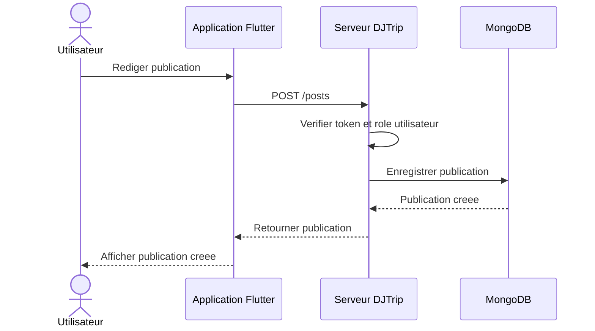

### P3 - Modifier publication

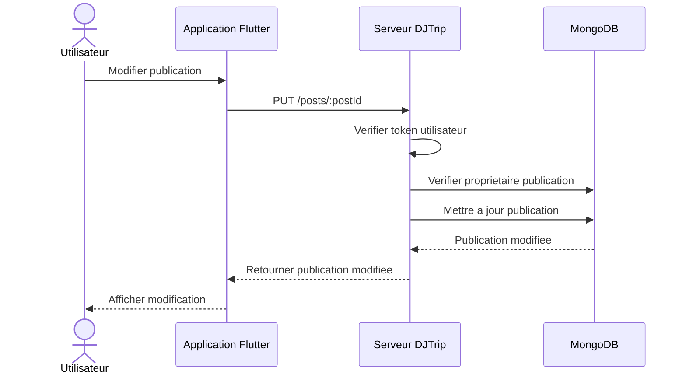

### P4 - Supprimer publication

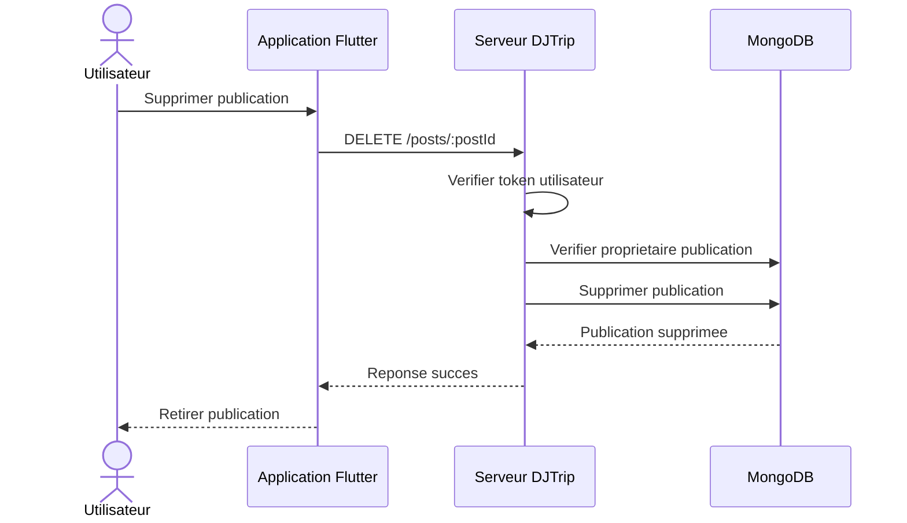

### P5 - Uploader image publication

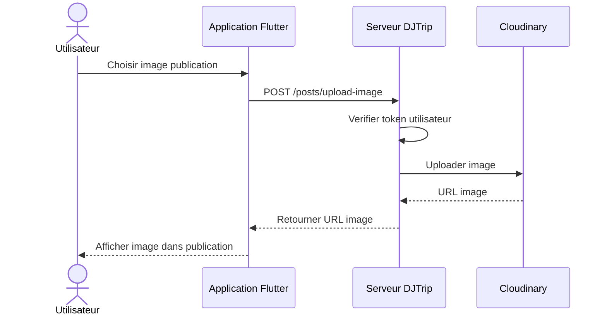

### P6 - Liker publication

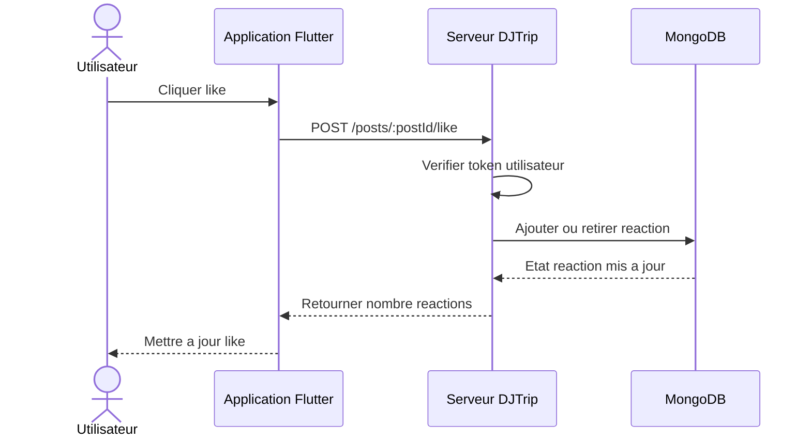

### P7 - Bookmarker publication

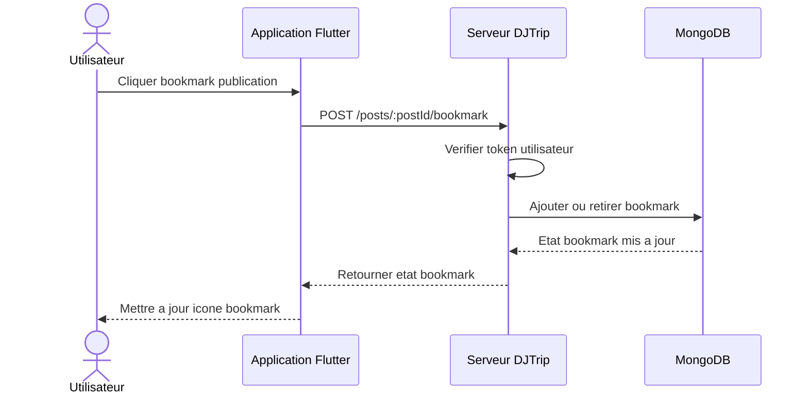

### P8 - Masquer publication

```mermaid
sequenceDiagram
  actor U as Utilisateur
  participant F as Application Flutter
  participant S as Serveur DJTrip
  participant DB as MongoDB

  U->>F: Masquer publication
  F->>S: POST /posts/:postId/hide
  S->>S: Verifier token utilisateur
  S->>DB: Mettre a jour visibilite publication
  DB-->>S: Publication masquee
  S-->>F: Reponse succes
  F-->>U: Retirer publication de l affichage
```

### C1 - Consulter commentaires

```mermaid
sequenceDiagram
  actor U as Utilisateur
  participant F as Application Flutter
  participant S as Serveur DJTrip
  participant DB as MongoDB

  U->>F: Ouvrir commentaires publication
  F->>S: GET /comments/:postId/comments
  S->>S: Verifier token utilisateur
  S->>DB: Recuperer commentaires
  DB-->>S: Liste commentaires
  S-->>F: Retourner commentaires
  F-->>U: Afficher commentaires
```

### C2 - Ajouter commentaire

```mermaid
sequenceDiagram
  actor U as Utilisateur
  participant F as Application Flutter
  participant S as Serveur DJTrip
  participant DB as MongoDB

  U->>F: Ecrire commentaire
  F->>S: POST /comments/:postId/comments
  S->>S: Verifier token utilisateur
  S->>DB: Enregistrer commentaire
  DB-->>S: Commentaire cree
  S-->>F: Retourner commentaire
  F-->>U: Afficher commentaire
```

### C3 - Repondre commentaire

```mermaid
sequenceDiagram
  actor U as Utilisateur
  participant F as Application Flutter
  participant S as Serveur DJTrip
  participant DB as MongoDB

  U->>F: Repondre a un commentaire
  F->>S: POST /comments/:postId/comments avec parentCommentId
  S->>S: Verifier token utilisateur
  S->>DB: Verifier commentaire parent
  S->>DB: Enregistrer reponse
  DB-->>S: Reponse creee
  S-->>F: Retourner reponse
  F-->>U: Afficher reponse
```

### C4 - Modifier commentaire

```mermaid
sequenceDiagram
  actor U as Utilisateur
  participant F as Application Flutter
  participant S as Serveur DJTrip
  participant DB as MongoDB

  U->>F: Modifier commentaire
  F->>S: PATCH /comments/:commentId
  S->>S: Verifier token utilisateur
  S->>DB: Verifier proprietaire commentaire
  S->>DB: Mettre a jour commentaire
  DB-->>S: Commentaire modifie
  S-->>F: Retourner commentaire modifie
  F-->>U: Afficher modification
```

### C5 - Supprimer commentaire

```mermaid
sequenceDiagram
  actor U as Utilisateur
  participant F as Application Flutter
  participant S as Serveur DJTrip
  participant DB as MongoDB

  U->>F: Supprimer commentaire
  F->>S: DELETE /comments/:commentId
  S->>S: Verifier token utilisateur
  S->>DB: Verifier droit de suppression
  S->>DB: Supprimer commentaire
  DB-->>S: Commentaire supprime
  S-->>F: Reponse succes
  F-->>U: Retirer commentaire
```

### C6 - Reagir commentaire

```mermaid
sequenceDiagram
  actor U as Utilisateur
  participant F as Application Flutter
  participant S as Serveur DJTrip
  participant DB as MongoDB

  U->>F: Reagir a un commentaire
  F->>S: POST /comments/:commentId/react
  S->>S: Verifier token utilisateur
  S->>DB: Ajouter ou modifier reaction
  DB-->>S: Reaction mise a jour
  S-->>F: Retourner reactions
  F-->>U: Afficher reaction
```

### C7 - Consulter reponses

```mermaid
sequenceDiagram
  actor U as Utilisateur
  participant F as Application Flutter
  participant S as Serveur DJTrip
  participant DB as MongoDB

  U->>F: Ouvrir reponses commentaire
  F->>S: GET /comments/:commentId/replies
  S->>S: Verifier token utilisateur
  S->>DB: Recuperer reponses
  DB-->>S: Liste reponses
  S-->>F: Retourner reponses
  F-->>U: Afficher reponses
```

### F1 - Suivre utilisateur

```mermaid
sequenceDiagram
  actor U as Utilisateur
  participant F as Application Flutter
  participant S as Serveur DJTrip
  participant DB as MongoDB

  U->>F: Cliquer suivre
  F->>S: POST /follow
  S->>S: Verifier token utilisateur
  S->>DB: Creer relation follow
  DB-->>S: Relation creee
  S-->>F: Reponse succes
  F-->>U: Afficher utilisateur suivi
```

### F2 - Ne plus suivre utilisateur

```mermaid
sequenceDiagram
  actor U as Utilisateur
  participant F as Application Flutter
  participant S as Serveur DJTrip
  participant DB as MongoDB

  U->>F: Cliquer ne plus suivre
  F->>S: DELETE /follow
  S->>S: Verifier token utilisateur
  S->>DB: Supprimer relation follow
  DB-->>S: Relation supprimee
  S-->>F: Reponse succes
  F-->>U: Afficher utilisateur non suivi
```

### F3 - Consulter followers

```mermaid
sequenceDiagram
  actor U as Utilisateur
  participant F as Application Flutter
  participant S as Serveur DJTrip
  participant DB as MongoDB

  U->>F: Consulter followers
  F->>S: GET /follow/followers/:userId
  S->>DB: Compter followers
  DB-->>S: Nombre followers
  S-->>F: Retourner nombre followers
  F-->>U: Afficher followers
```

### F4 - Consulter following

```mermaid
sequenceDiagram
  actor U as Utilisateur
  participant F as Application Flutter
  participant S as Serveur DJTrip
  participant DB as MongoDB

  U->>F: Consulter following
  F->>S: GET /follow/following/:userId
  S->>DB: Compter following
  DB-->>S: Nombre following
  S-->>F: Retourner nombre following
  F-->>U: Afficher following
```
