# Decoupage des sprints - DJTrip

> Important : cette version ne contient aucun paiement. Les reservations sont gerees sans Stripe.

## Sprint 1 - Authentification et profils

### Diagramme de cas d'utilisation

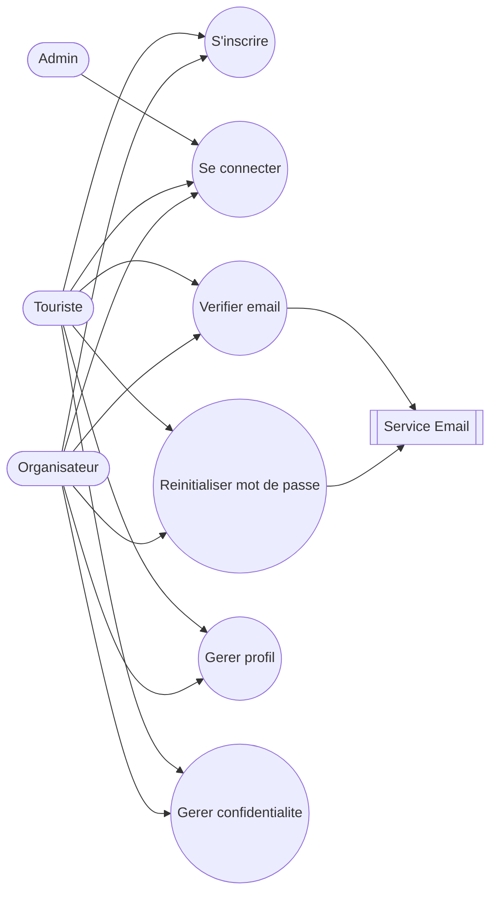

### UC1 - S'inscrire

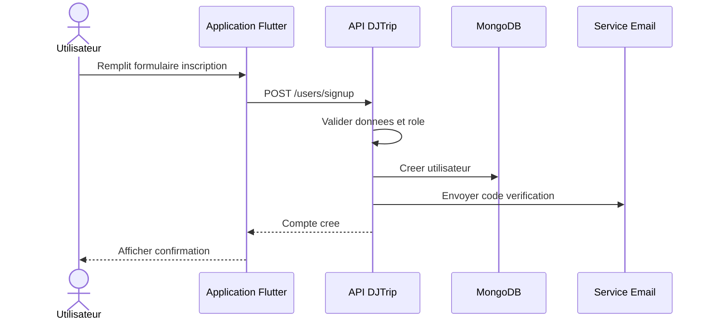

### UC2 - Se connecter

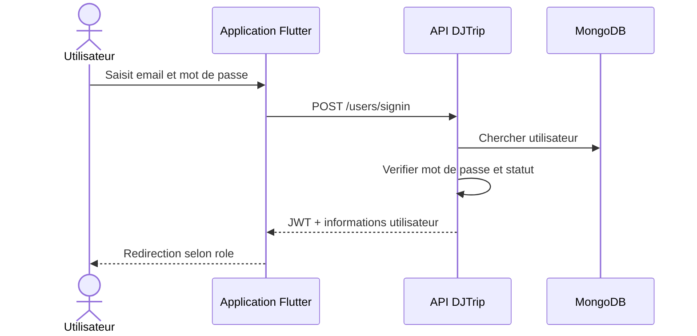

### UC3 - Verifier email

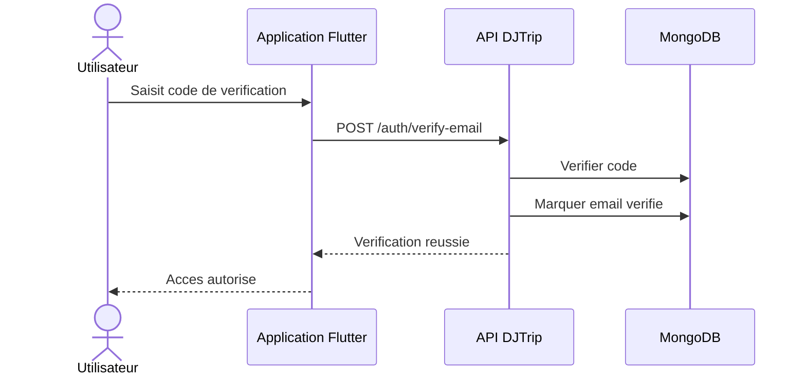

### UC4 - Reinitialiser mot de passe

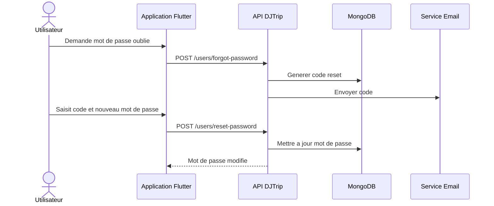

### UC5 - Gerer profil

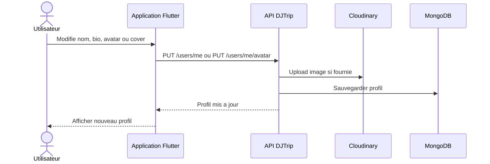

### UC6 - Gerer confidentialite

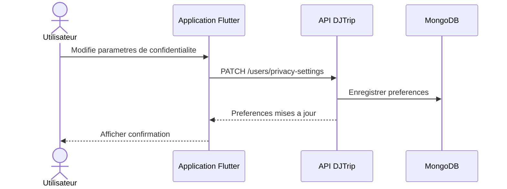

## Sprint 2 - Activites et lieux touristiques

### Diagramme de cas d'utilisation

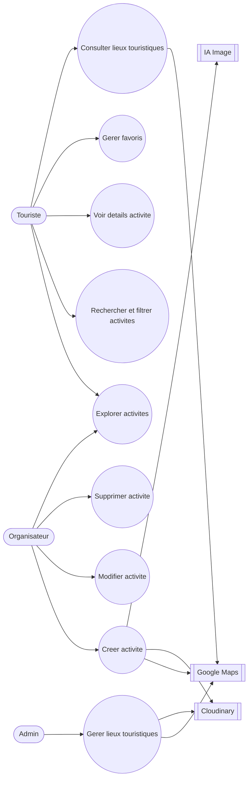

### UC1 - Explorer activites

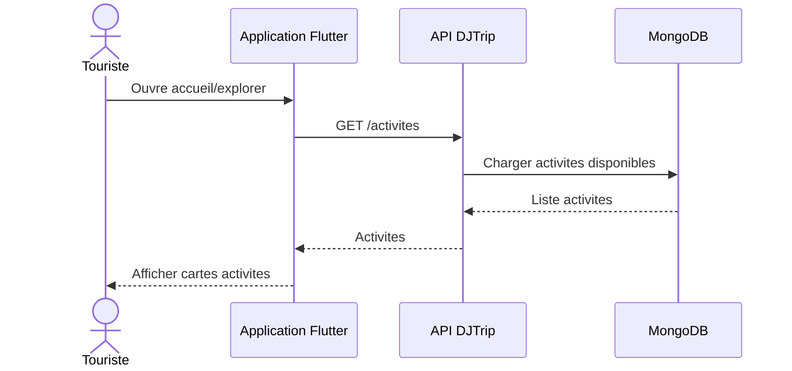

### UC2 - Rechercher et filtrer activites

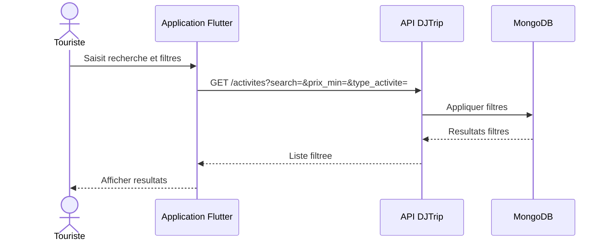

### UC3 - Voir details activite

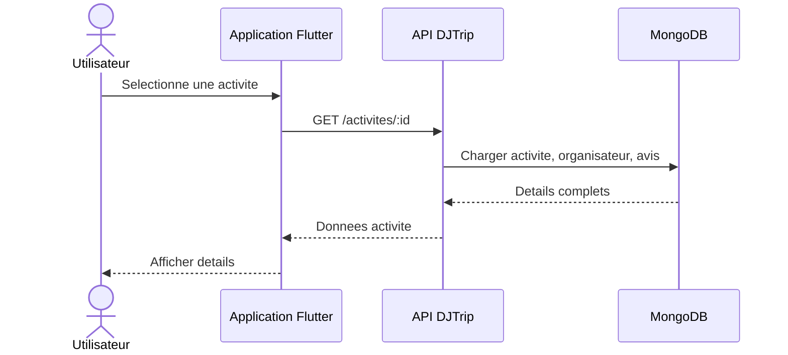

### UC4 - Gerer favoris

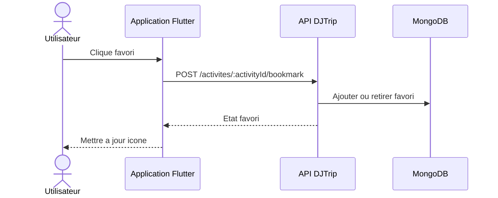

### UC5 - Creer activite

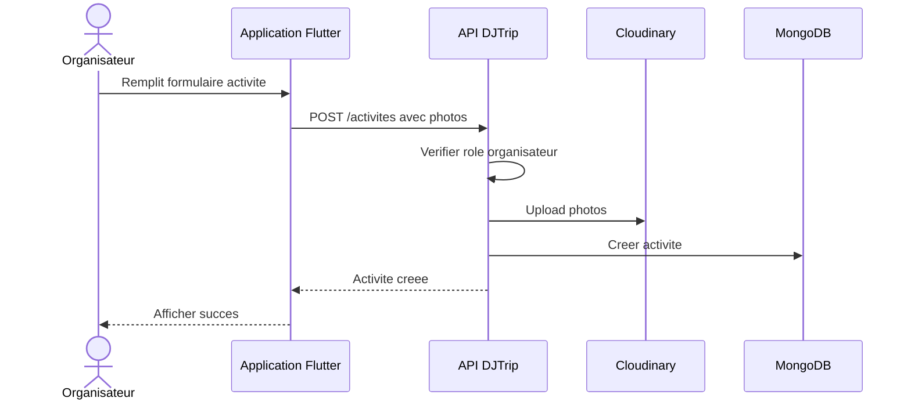

### UC6 - Modifier activite

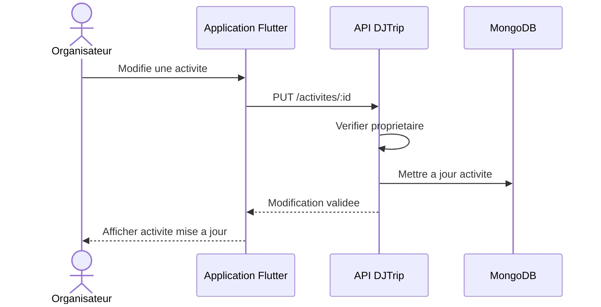

### UC7 - Supprimer activite

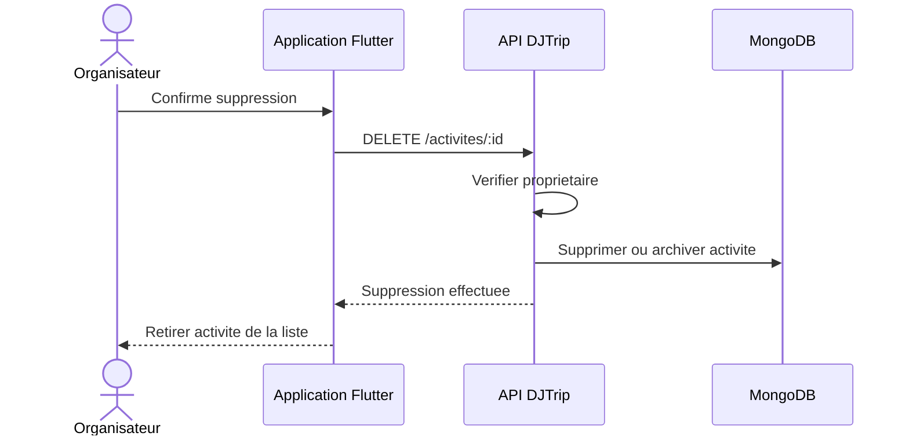

### UC8 - Consulter lieux touristiques

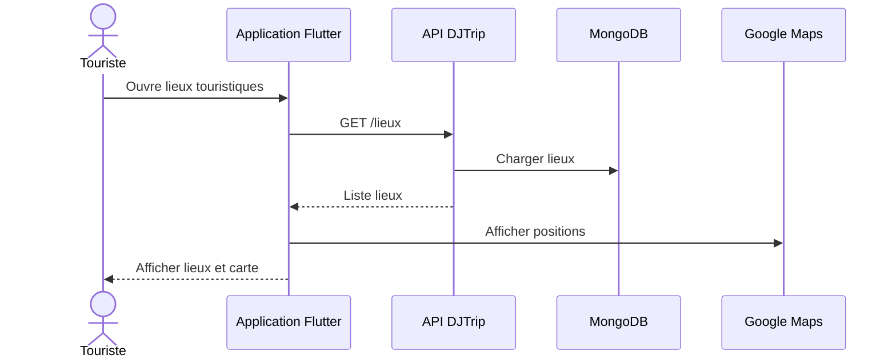

### UC9 - Gerer lieux touristiques

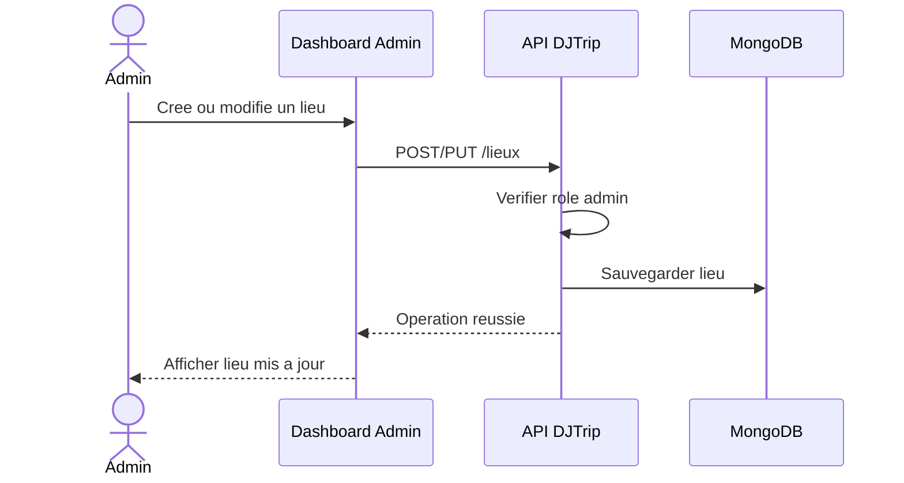

## Sprint 3 - Reservations et QR code sans paiement

### Diagramme de cas d'utilisation

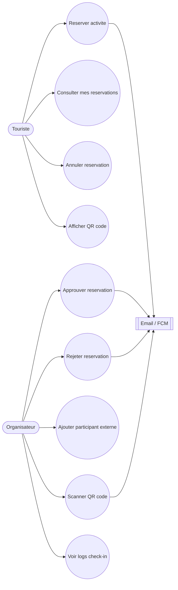

### UC1 - Reserver activite

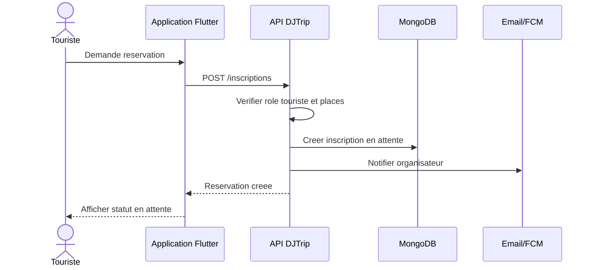

### UC2 - Consulter mes reservations

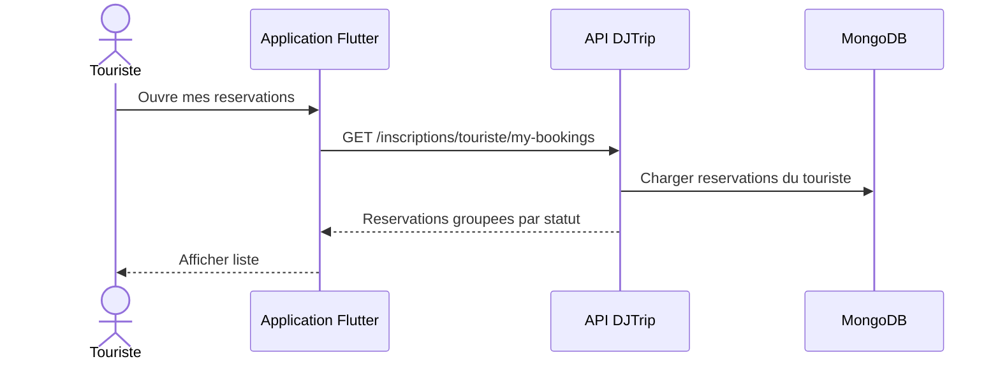

### UC3 - Annuler reservation

```mermaid
sequenceDiagram
  actor T as Touriste
  participant F as Application Flutter
  participant API as API DJTrip
  participant DB as MongoDB
  participant Notif as Email/FCM

  T->>F: Confirme annulation
  F->>API: PUT /inscriptions/:id/annuler
  API->>API: Verifier proprietaire
  API->>DB: Changer statut en annulee
  API->>Notif: Notifier organisateur
  API-->>F: Annulation validee
```

### UC4 - Approuver reservation

```mermaid
sequenceDiagram
  actor O as Organisateur
  participant F as Application Flutter
  participant API as API DJTrip
  participant DB as MongoDB
  participant Notif as Email/FCM

  O->>F: Approuve demande
  F->>API: PUT /inscriptions/:id/approve
  API->>API: Verifier organisateur de l'activite
  API->>DB: Statut approuve + generer QR
  API->>Notif: Notifier touriste
  API-->>F: Reservation approuvee
```

### UC5 - Rejeter reservation

```mermaid
sequenceDiagram
  actor O as Organisateur
  participant F as Application Flutter
  participant API as API DJTrip
  participant DB as MongoDB
  participant Notif as Email/FCM

  O->>F: Rejette demande
  F->>API: PUT /inscriptions/:id/reject
  API->>API: Verifier organisateur
  API->>DB: Statut rejetee
  API->>Notif: Notifier touriste
  API-->>F: Rejet confirme
```

### UC6 - Ajouter participant externe

```mermaid
sequenceDiagram
  actor O as Organisateur
  participant F as Application Flutter
  participant API as API DJTrip
  participant DB as MongoDB

  O->>F: Ajoute participant manuel
  F->>API: POST /inscriptions/organisateur/external
  API->>API: Verifier organisateur et capacite
  API->>DB: Creer participant externe
  API-->>F: Participant ajoute
```

### UC7 - Afficher QR code

```mermaid
sequenceDiagram
  actor T as Touriste
  participant F as Application Flutter
  participant API as API DJTrip
  participant DB as MongoDB

  T->>F: Ouvre detail reservation
  F->>API: GET /inscriptions/:id
  API->>DB: Charger reservation approuvee
  API-->>F: Token QR
  F-->>T: Afficher QR code
```

### UC8 - Scanner QR code

```mermaid
sequenceDiagram
  actor O as Organisateur
  participant F as Application Flutter
  participant API as API DJTrip
  participant DB as MongoDB
  participant Log as CheckinLog

  O->>F: Scanne QR code
  F->>API: POST /inscriptions/qr/validate
  API->>DB: Verifier token et reservation
  API->>DB: Marquer presence validee
  API->>Log: Enregistrer tentative check-in
  API-->>F: Validation reussie
  F-->>O: Afficher confirmation
```

### UC9 - Voir logs check-in

```mermaid
sequenceDiagram
  actor O as Organisateur
  participant F as Application Flutter
  participant API as API DJTrip
  participant DB as MongoDB

  O->>F: Ouvre historique check-in
  F->>API: GET /checkin-logs/organizer
  API->>DB: Charger logs organisateur
  API-->>F: Logs check-in
  F-->>O: Afficher historique
```

## Sprint 4 - Communication et reseau social

### Diagramme de cas d'utilisation

```mermaid
flowchart LR
  Touriste([Touriste])
  Organisateur([Organisateur])
  Socket[[Socket.IO]]
  Cloud[[Cloudinary]]

  UC1(("Envoyer message"))
  UC2(("Envoyer media"))
  UC3(("Gerer conversation"))
  UC4(("Creer publication"))
  UC5(("Liker / enregistrer post"))
  UC6(("Commenter post"))
  UC7(("Suivre utilisateur"))

  Touriste --> UC1
  Organisateur --> UC1
  Touriste --> UC2
  Organisateur --> UC2
  Touriste --> UC3
  Organisateur --> UC3
  Touriste --> UC4
  Organisateur --> UC4
  Touriste --> UC5
  Organisateur --> UC5
  Touriste --> UC6
  Organisateur --> UC6
  Touriste --> UC7
  Organisateur --> UC7
  UC1 --> Socket
  UC2 --> Cloud
```

### UC1 - Envoyer message

```mermaid
sequenceDiagram
  actor U as Utilisateur
  participant F as Application Flutter
  participant API as API DJTrip
  participant DB as MongoDB
  participant S as Socket.IO

  U->>F: Ecrit message
  F->>API: POST /messages/with/:partnerId
  API->>DB: Sauvegarder message
  API->>S: Emettre message temps reel
  API-->>F: Message envoye
```

### UC2 - Envoyer media

```mermaid
sequenceDiagram
  actor U as Utilisateur
  participant F as Application Flutter
  participant API as API DJTrip
  participant Cloud as Cloudinary
  participant DB as MongoDB

  U->>F: Choisit image/audio/video
  F->>API: POST /messages/with/:partnerId/image|audio|video
  API->>Cloud: Stocker media
  API->>DB: Sauvegarder message media
  API-->>F: Media envoye
```

### UC3 - Gerer conversation

```mermaid
sequenceDiagram
  actor U as Utilisateur
  participant F as Application Flutter
  participant API as API DJTrip
  participant DB as MongoDB

  U->>F: Archive, mute, bloque ou supprime
  F->>API: POST/DELETE /messages/conversations/:partnerId/action
  API->>DB: Mettre a jour conversation
  API-->>F: Action appliquee
```

### UC4 - Creer publication

```mermaid
sequenceDiagram
  actor U as Utilisateur
  participant F as Application Flutter
  participant API as API DJTrip
  participant DB as MongoDB

  U->>F: Redige publication
  F->>API: POST /posts
  API->>API: Verifier role touriste ou organisateur
  API->>DB: Sauvegarder post
  API-->>F: Post cree
```

### UC5 - Liker / enregistrer post

```mermaid
sequenceDiagram
  actor U as Utilisateur
  participant F as Application Flutter
  participant API as API DJTrip
  participant DB as MongoDB

  U->>F: Clique like ou bookmark
  F->>API: POST /posts/:postId/like ou /bookmark
  API->>DB: Ajouter ou retirer interaction
  API-->>F: Etat mis a jour
```

### UC6 - Commenter post

```mermaid
sequenceDiagram
  actor U as Utilisateur
  participant F as Application Flutter
  participant API as API DJTrip
  participant DB as MongoDB

  U->>F: Ecrit commentaire
  F->>API: POST /comments/:postId/comments
  API->>DB: Sauvegarder commentaire
  API-->>F: Commentaire publie
```

### UC7 - Suivre utilisateur

```mermaid
sequenceDiagram
  actor U as Utilisateur
  participant F as Application Flutter
  participant API as API DJTrip
  participant DB as MongoDB

  U->>F: Clique suivre
  F->>API: POST /follow
  API->>DB: Creer relation follow
  API-->>F: Abonnement confirme
```

## Sprint 5 - Avis, notifications et reclamations

### Diagramme de cas d'utilisation

```mermaid
flowchart LR
  Touriste([Touriste])
  Organisateur([Organisateur])
  Admin([Admin])
  Notif[[Email / FCM]]

  UC1(("Donner avis activite"))
  UC2(("Noter organisateur"))
  UC3(("Modifier ou supprimer avis"))
  UC4(("Consulter notifications"))
  UC5(("Configurer preferences notifications"))
  UC6(("Soumettre reclamation"))
  UC7(("Suivre reclamation"))
  UC8(("Traiter reclamation"))

  Touriste --> UC1
  Touriste --> UC2
  Touriste --> UC3
  Touriste --> UC4
  Organisateur --> UC4
  Touriste --> UC5
  Organisateur --> UC5
  Touriste --> UC6
  Organisateur --> UC6
  Touriste --> UC7
  Organisateur --> UC7
  Admin --> UC8
  UC4 --> Notif
  UC8 --> Notif
```

### UC1 - Donner avis activite

```mermaid
sequenceDiagram
  actor T as Touriste
  participant F as Application Flutter
  participant API as API DJTrip
  participant DB as MongoDB

  T->>F: Saisit note et commentaire
  F->>API: POST /avis/activite/:activiteId
  API->>API: Verifier participation
  API->>DB: Enregistrer avis
  API-->>F: Avis publie
```

### UC2 - Noter organisateur

```mermaid
sequenceDiagram
  actor T as Touriste
  participant F as Application Flutter
  participant API as API DJTrip
  participant DB as MongoDB

  T->>F: Note organisateur
  F->>API: POST /avis/organisateur/:organisateurId
  API->>DB: Enregistrer notation
  API-->>F: Note sauvegardee
```

### UC3 - Modifier ou supprimer avis

```mermaid
sequenceDiagram
  actor T as Touriste
  participant F as Application Flutter
  participant API as API DJTrip
  participant DB as MongoDB

  T->>F: Modifie ou supprime son avis
  F->>API: PUT ou DELETE /avis/:avisId
  API->>API: Verifier proprietaire avis
  API->>DB: Modifier ou supprimer avis
  API-->>F: Action confirmee
```

### UC4 - Consulter notifications

```mermaid
sequenceDiagram
  actor U as Utilisateur
  participant F as Application Flutter
  participant API as API DJTrip
  participant DB as MongoDB

  U->>F: Ouvre notifications
  F->>API: GET /notifications
  API->>DB: Charger notifications utilisateur
  API-->>F: Liste notifications
  F-->>U: Afficher notifications
```

### UC5 - Configurer preferences notifications

```mermaid
sequenceDiagram
  actor U as Utilisateur
  participant F as Application Flutter
  participant API as API DJTrip
  participant DB as MongoDB

  U->>F: Active/desactive push ou email
  F->>API: PUT /notifications/preferences
  API->>DB: Sauvegarder preferences
  API-->>F: Preferences confirmees
```

### UC6 - Soumettre reclamation

```mermaid
sequenceDiagram
  actor U as Utilisateur
  participant F as Application Flutter
  participant API as API DJTrip
  participant DB as MongoDB

  U->>F: Redige reclamation
  F->>API: POST /appeals
  API->>DB: Creer reclamation
  API-->>F: Reclamation envoyee
```

### UC7 - Suivre reclamation

```mermaid
sequenceDiagram
  actor U as Utilisateur
  participant F as Application Flutter
  participant API as API DJTrip
  participant DB as MongoDB

  U->>F: Consulte mes reclamations
  F->>API: GET /appeals/me
  API->>DB: Charger reclamations utilisateur
  API-->>F: Liste reclamations
```

### UC8 - Traiter reclamation

```mermaid
sequenceDiagram
  actor A as Admin
  participant D as Dashboard Admin
  participant API as API DJTrip
  participant DB as MongoDB
  participant Notif as Email/FCM

  A->>D: Accepte ou rejette reclamation
  D->>API: PATCH /appeals/admin/:id
  API->>DB: Mettre a jour statut
  API->>Notif: Notifier utilisateur
  API-->>D: Traitement confirme
```

## Sprint 6 - Chatbot IA et assistance intelligente

### Diagramme de cas d'utilisation

```mermaid
flowchart LR
  Utilisateur([Touriste / Organisateur / Admin])
  Chatbot[[Chatbot IA]]
  Docs[(Documentation projet)]
  Gemini[[Google Gemini]]

  UC1(("Poser question au chatbot"))
  UC2(("Rechercher dans la documentation"))
  UC3(("Generer reponse assistee par IA"))
  UC4(("Afficher historique conversation"))

  Utilisateur --> UC1
  UC1 --> UC2
  UC2 --> Docs
  UC2 --> UC3
  UC3 --> Gemini
  Utilisateur --> UC4
  Chatbot --> UC1
```

### UC1 - Poser question au chatbot

```mermaid
sequenceDiagram
  actor U as Utilisateur
  participant UI as Interface Chatbot
  participant API as API Chatbot
  participant RAG as Moteur RAG

  U->>UI: Pose une question
  UI->>API: Envoyer question
  API->>RAG: Preparer recherche contexte
  RAG-->>API: Contexte pertinent
  API-->>UI: Reponse preliminaire
  UI-->>U: Afficher reponse
```

### UC2 - Rechercher dans la documentation

```mermaid
sequenceDiagram
  participant API as API Chatbot
  participant Index as Index documentaire
  participant Docs as Documentation

  API->>Index: Chercher passages proches
  Index->>Docs: Recuperer extraits
  Docs-->>Index: Extraits utiles
  Index-->>API: Contexte classe par pertinence
```

### UC3 - Generer reponse assistee par IA

```mermaid
sequenceDiagram
  participant API as API Chatbot
  participant Gemini as Google Gemini
  participant UI as Interface Chatbot

  API->>Gemini: Prompt + contexte documentation
  Gemini-->>API: Reponse generee
  API->>API: Nettoyer et structurer reponse
  API-->>UI: Reponse finale
```

### UC4 - Afficher historique conversation

```mermaid
sequenceDiagram
  actor U as Utilisateur
  participant UI as Interface Chatbot
  participant Store as Stockage local ou serveur

  U->>UI: Ouvre chatbot
  UI->>Store: Charger historique
  Store-->>UI: Messages precedents
  UI-->>U: Afficher conversation
```

## Sprint 7 - Administration, statistiques et finalisation

### Diagramme de cas d'utilisation

```mermaid
flowchart LR
  Admin([Admin])
  Dev([Equipe projet])
  DB[(MongoDB)]
  Logs[(System logs)]

  UC1(("Gerer utilisateurs"))
  UC2(("Valider organisateurs"))
  UC3(("Moderation activites"))
  UC4(("Moderation posts/commentaires/avis"))
  UC5(("Traiter reclamations"))
  UC6(("Consulter statistiques"))
  UC7(("Consulter logs systeme"))
  UC8(("Tester et finaliser documentation"))

  Admin --> UC1
  Admin --> UC2
  Admin --> UC3
  Admin --> UC4
  Admin --> UC5
  Admin --> UC6
  Admin --> UC7
  Dev --> UC8
  UC1 --> DB
  UC2 --> DB
  UC3 --> DB
  UC4 --> DB
  UC5 --> DB
  UC6 --> DB
  UC7 --> Logs
  UC8 --> DB
```

### UC1 - Gerer utilisateurs

```mermaid
sequenceDiagram
  actor A as Admin
  participant D as Dashboard Admin
  participant API as API DJTrip
  participant DB as MongoDB

  A->>D: Ouvre la liste utilisateurs
  D->>API: GET /users
  API->>API: Verifier token et role Admin
  API->>DB: Charger utilisateurs
  DB-->>API: Liste utilisateurs
  API-->>D: Donnees utilisateurs

  alt Voir details utilisateur
      A->>D: Ouvre une fiche utilisateur
      D->>API: GET /users/:id/overview
      API->>DB: Charger profil et donnees liees
      API-->>D: Vue complete utilisateur
  else Suspendre / reactiver
      A->>D: Modifie le statut
      D->>API: PUT /users/:id/status
      API->>DB: Mettre a jour accountStatus
      API-->>D: Statut modifie
  else Bannir un utilisateur
      A->>D: Confirme le bannissement
      D->>API: PUT /users/:id/ban
      API->>DB: Passer accountStatus a banned
      API-->>D: Utilisateur banni
  else Restaurer un utilisateur
      A->>D: Confirme la restauration
      D->>API: PUT /users/:id/unban
      API->>DB: Passer accountStatus a active
      API-->>D: Utilisateur restaure
  else Supprimer un compte
      A->>D: Confirme la suppression
      D->>API: DELETE /users/:id
      API->>DB: Supprimer utilisateur
      API-->>D: Compte supprime
  end
```

### UC2 - Valider organisateurs

```mermaid
sequenceDiagram
  actor A as Admin
  participant D as Dashboard Admin
  participant API as API DJTrip
  participant DB as MongoDB

  A->>D: Consulte les demandes organisateurs
  D->>API: GET /onboarding/approvals/pending
  API->>API: Verifier token et role Admin
  API->>DB: Charger organisateurs en attente
  API-->>D: Liste demandes

  alt Approuver organisateur
      A->>D: Approuve la demande
      D->>API: POST /onboarding/approvals/:organizerId/approve
      API->>DB: Marquer organisateur approuve
      API-->>D: Approbation confirmee
  else Rejeter organisateur
      A->>D: Saisit motif de rejet
      D->>API: POST /onboarding/approvals/:organizerId/reject
      API->>DB: Enregistrer rejet et motif
      API-->>D: Rejet confirme
  end
```

### UC3 - Moderation activites

```mermaid
sequenceDiagram
  actor A as Admin
  participant D as Dashboard Admin
  participant API as API DJTrip
  participant DB as MongoDB

  A->>D: Ouvre la gestion activites
  D->>API: GET /activites/admin
  API->>API: Verifier token et role Admin
  API->>DB: Charger activites
  API-->>D: Liste activites

  alt Creer une activite
      A->>D: Remplit formulaire admin
      D->>API: POST /activites/admin
      API->>DB: Creer activite
      API-->>D: Creation confirmee
  else Modifier une activite
      A->>D: Modifie les donnees
      D->>API: PUT /activites/admin/:id
      API->>DB: Mettre a jour activite
      API-->>D: Modification confirmee
  else Supprimer une activite
      A->>D: Confirme suppression
      D->>API: DELETE /activites/admin/:id
      API->>DB: Supprimer activite
      API-->>D: Suppression confirmee
  end
```

### UC4 - Moderation posts/commentaires/avis

```mermaid
sequenceDiagram
  actor A as Admin
  participant D as Dashboard Admin
  participant API as API DJTrip
  participant DB as MongoDB

  A->>D: Ouvre moderation contenu

  par Charger posts
      D->>API: GET /posts/admin
      API->>DB: Charger publications
      API-->>D: Posts admin
  and Charger commentaires
      D->>API: GET /comments/admin
      API->>DB: Charger commentaires
      API-->>D: Commentaires admin
  end

  alt Creer post admin
      A->>D: Redige publication admin
      D->>API: POST /posts/admin
      API->>DB: Creer post
      API-->>D: Post cree
  else Modifier post
      A->>D: Edite publication
      D->>API: PUT /posts/admin/:postId
      API->>DB: Mettre a jour post
      API-->>D: Post modifie
  else Supprimer post
      A->>D: Supprime publication
      D->>API: DELETE /posts/admin/:postId
      API->>DB: Supprimer post
      API-->>D: Post supprime
  else Supprimer commentaire
      A->>D: Supprime commentaire
      D->>API: DELETE /comments/admin/:commentId
      API->>DB: Supprimer commentaire
      API-->>D: Commentaire supprime
  else Supprimer avis
      A->>D: Supprime avis
      D->>API: DELETE /avis/admin/:avisId
      API->>DB: Supprimer avis
      API-->>D: Avis supprime
  end
```

### UC5 - Traiter reclamations

```mermaid
sequenceDiagram
  actor A as Admin
  participant D as Dashboard Admin
  participant API as API DJTrip
  participant DB as MongoDB
  participant Notif as Email/FCM

  A->>D: Ouvre les reclamations
  D->>API: GET /appeals/admin
  API->>API: Verifier token et role Admin
  API->>DB: Charger reclamations
  API-->>D: Liste reclamations

  A->>D: Ouvre une reclamation
  D->>API: GET /appeals/admin/:id
  API->>DB: Charger details reclamation
  API-->>D: Details reclamation

  alt Accepter / rejeter
      A->>D: Saisit decision et reponse
      D->>API: PATCH /appeals/admin/:id
      API->>DB: Mettre a jour statut reclamation
      API->>Notif: Notifier utilisateur
      API-->>D: Traitement confirme
  else Supprimer reclamation
      A->>D: Confirme suppression
      D->>API: DELETE /appeals/admin/:id
      API->>DB: Supprimer reclamation
      API-->>D: Suppression confirmee
  end
```

### UC6 - Consulter statistiques

```mermaid
sequenceDiagram
  actor A as Admin
  participant D as Dashboard Admin
  participant API as API DJTrip
  participant DB as MongoDB

  A->>D: Ouvre le tableau de bord

  par Statistiques onboarding
      D->>API: GET /onboarding/stats
      API->>DB: Agreger comptes et approbations
      DB-->>API: Donnees onboarding
      API-->>D: Stats onboarding
  and Statistiques reclamations
      D->>API: GET /appeals/admin/stats
      API->>DB: Agreger reclamations par statut
      DB-->>API: Donnees reclamations
      API-->>D: Stats reclamations
  and Donnees activites admin
      D->>API: GET /activites/admin
      API->>DB: Charger activites pour indicateurs
      DB-->>API: Donnees activites
      API-->>D: Indicateurs activites
  end
```

### UC7 - Consulter logs systeme

```mermaid
sequenceDiagram
  actor A as Admin
  participant D as Dashboard Admin
  participant API as API DJTrip
  participant Logs as SystemLogStore
  participant DB as MongoDB

  A->>D: Consulte les journaux

  alt Logs systeme
      D->>API: GET /system-logs
      API->>API: Verifier token et role Admin
      API->>Logs: Charger historique systeme
      API-->>D: Liste des logs systeme
  else Logs d'activite API
      D->>API: GET /logs
      API->>DB: Charger logs d'activite
      API-->>D: Liste des actions journalisees
  else Logs d'un utilisateur
      D->>API: GET /logs/:userId
      API->>DB: Charger logs utilisateur
      API-->>D: Historique utilisateur
  end

  D-->>A: Afficher journaux
```

### UC8 - Tester et finaliser documentation

```mermaid
sequenceDiagram
  actor Dev as Equipe projet
  participant App as Application Flutter
  participant Dash as Dashboard Admin
  participant API as API DJTrip
  participant Doc as Documentation

  Dev->>App: Execute scenarios mobiles
  App->>API: Appels API utilisateur
  Dev->>Dash: Execute scenarios admin
  Dash->>API: Appels API admin

  alt Tests reussis
      API-->>App: Succes
      API-->>Dash: Succes
      Dev->>Doc: Mettre a jour diagrammes et rapports
  else Tests echoues
      API-->>App: Erreur fonctionnelle
      API-->>Dash: Erreur fonctionnelle
      Dev->>API: Corriger code ou configuration
      Dev->>Doc: Documenter correction
  end

  Doc-->>Dev: Version finale PFE preparee
```
